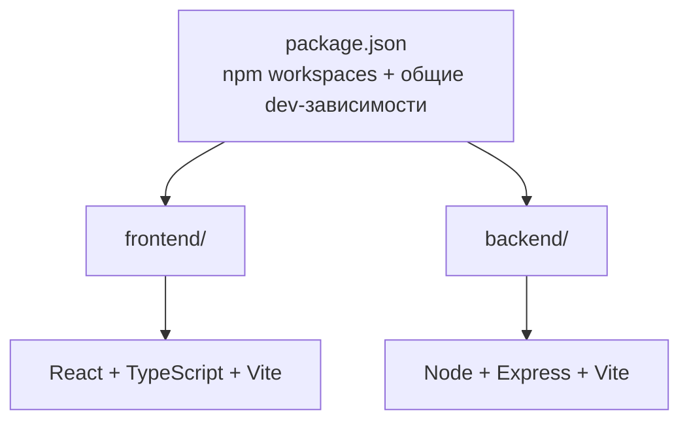

# Family — Web Application

Монорепозиторий веб-приложения: фронтенд на **React + TypeScript + Vite** и бэкенд на **Node.js + Express + Vite**. Управление зависимостями — через **npm workspaces** (общие dev-зависимости вынесены в корневой `package.json`).

## Структура проекта



```
.
├── package.json              # npm workspaces, общие скрипты и dev-зависимости
├── tsconfig.base.json        # общая конфигурация TypeScript
├── .prettierrc.json          # единый стиль кода
├── .gitignore
├── README.md
│
├── frontend/                 # React + TypeScript + Vite
│   ├── package.json
│   ├── tsconfig.json
│   ├── vite.config.ts        # dev-порт 5173, proxy /api -> :3000
│   ├── index.html
│   ├── .env.example
│   └── src/
│       ├── main.tsx          # точка входа React
│       ├── App.tsx           # корневой компонент
│       ├── index.css         # глобальные стили
│       ├── api/              # HTTP-клиент (fetch к /api)
│       ├── components/       # переиспользуемые UI-компоненты
│       ├── hooks/            # пользовательские React-хуки
│       ├── pages/            # страницы приложения
│       └── vite-env.d.ts
│
└── backend/                  # Node + Express + Vite
    ├── package.json
    ├── tsconfig.json
    ├── vite.config.ts        # dev-порт 3000, HMR через vite-plugin-node
    ├── .env.example
    └── src/
        ├── app.ts            # Express-приложение (экспорт app + автостарт при прямом запуске)
        ├── config/           # конфигурация окружения
        ├── routes/           # маршруты API
        ├── controllers/      # обработчики запросов
        ├── services/         # бизнес-логика
        ├── models/           # модели данных
        └── middlewares/      # middleware (ошибки, 404 и т.д.)
```

## Установка

Требуется Node.js **20+** и npm **10+**.

```bash
npm install
```

## Запуск

| Команда                | Описание                                       |
| ---------------------- | ---------------------------------------------- |
| `npm run dev`          | Запуск фронтенда и бэкенда одновременно        |
| `npm run dev:frontend` | Только фронтенд (http://localhost:5173)        |
| `npm run dev:backend`  | Только бэкенд (http://localhost:3000)          |
| `npm run build`        | Сборка фронтенда и бэкенда                     |
| `npm start`            | Запуск собранного бэкенда (`backend/dist/app.cjs`) |
| `npm run typecheck`    | Проверка типов во всех воркспейсах             |
| `npm run format`       | Форматирование кода через Prettier             |

## Как это работает

- **Фронтенд** запускается через Vite dev-сервер на порту `5173`. Запросы к `/api/*` проксируются на бэкенд (`vite.config.ts`), поэтому в разработке не нужен CORS.
- **Бэкенд** запускается через Vite c плагином `vite-plugin-node` — Express-приложение получает горячую перезагрузку при изменении кода. Приложение экспортируется из `src/app.ts`; при прямом запуске собранного `dist/app.cjs` (`npm start`) оно само стартует сервер на порту из `PORT`.
- **Общие dev-зависимости** (`typescript`, `vite`, `@vitejs/plugin-react`, `vite-plugin-node`, `@types/*`, `prettier`, `concurrently`) подняты в корневой `package.json`, рантайм-зависимости лежат в `frontend/` и `backend/` соответственно.

## Проверка

После `npm run dev` откройте http://localhost:5173 — страница покажет статус бэкенда (ответ `/api/health`).
