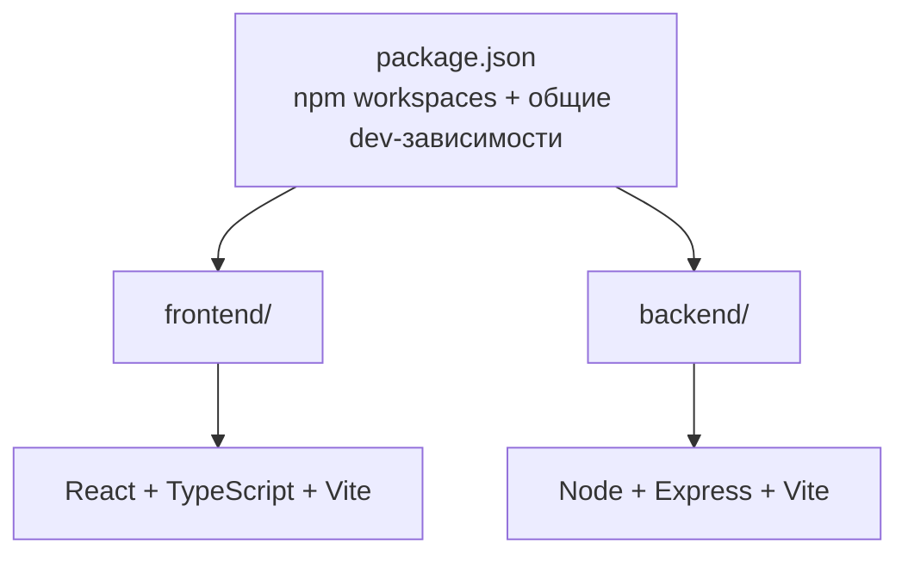

# Family — Web Application

Монорепозиторий веб-приложения: фронтенд на **React + TypeScript + Vite** и бэкенд на **Node.js + Express + Vite**. Управление зависимостями — через **npm workspaces** (общие dev-зависимости вынесены в корневой `package.json`).

## Структура проекта



```
.
├── package.json              # npm workspaces, общие скрипты и dev-зависимости
├── tsconfig.base.json        # общая конфигурация TypeScript
├── .prettierrc.json          # единый стиль кода
├── .gitignore
├── AGENTS.md                 # инструкции для ИИ-агентов (команды, правила, грабли)
├── .github/                  # кастомизации для ИИ-агентов
│   ├── agents/               # агенты (специализированные роли, выбор в чате)
│   │   ├── frontend-dev.agent.md  # фронтенд-разработчик (React/TS/Vite)
│   │   ├── backend-dev.agent.md   # бэкенд-разработчик (Express/SQLite)
│   │   └── fullstack-dev.agent.md # сквозные фичи (бэкенд + фронтенд)
│   ├── instructions/         # файловые инструкции (авто-применение по applyTo)
│   │   ├── frontend.instructions.md # конвенции фронтенда (frontend/src/**)
│   │   ├── backend.instructions.md  # конвенции бэкенда (backend/src/**)
│   │   └── project.renovation.instructions.md # конвенции проекта «Ремонт» (projects/renovation/**)
│   └── skills/               # скиллы (загружаются по запросу)
│       ├── vps/              # VPS-мониторинг: SKILL.md, справочник, scripts/list-vps.mjs
│       ├── deploy/           # деплой и диагностика сервера: SKILL.md, справочник
│       ├── project-renovation-build-reports/ # отчётность по ремонту (projects/renovation)
│       └── parse-pdf/        # конвертация PDF → HTML (общий, для любых проектов)
├── README.md
├── docs/                     # спецификация и справочники (см. «Документация»)
│   ├── specification.md      # спецификация (Specification Driven Development)
│   └── server.md             # справочник по серверу/nginx/SSL/деплою
│
├── projects/                 # статичные страницы проектов (шаблон + подпапки)
│   ├── styles.css            # общий дизайн/тема страниц проектов
│   ├── theme.js              # тема (light/dark/system) для страниц проектов
│   ├── icon-sprite.svg       # общий SVG-спрайт иконок проектов
│   ├── _template/index.html  # шаблон новой страницы проекта (в деплой не попадает)
│   └── renovation/           # проект «Ремонт» (отчётность, в стиле приложения)
│       ├── index.html        # главная страница проекта
│       ├── estimate_seed.html # исходная смета (никогда не меняется)
│       ├── estimate.html     # актуальная смета (обновляется по доп. соглашениям)
│       ├── estimate_*.html   # исторические копии сметы (по датам доп. соглашений)
│       ├── Reports/          # отчёты: report_work, report_materials, report_final
│       ├── Materials/        # заказы материалов (report_*.html) + взаиморасчёты по материалам
│       └── Works/            # акты работ (act_*.html) + взаиморасчёты по работам
│
├── frontend/                 # React + TypeScript + Vite
│   ├── package.json
│   ├── tsconfig.json
│   ├── vite.config.ts        # dev-порт 5173, proxy /api -> :3000
│   ├── index.html
│   ├── .env.example
│   └── src/
│       ├── main.tsx          # точка входа React
│       ├── App.tsx           # корневой компонент
│       ├── index.css         # глобальные стили
│       ├── api/              # HTTP-клиент (fetch к /api)
│       ├── components/       # переиспользуемые UI-компоненты
│       ├── hooks/            # пользовательские React-хуки
│       ├── pages/            # страницы приложения
│       └── vite-env.d.ts
│
└── backend/                  # Node + Express + Vite
    ├── package.json
    ├── tsconfig.json
    ├── vite.config.ts        # dev-порт 3000, HMR через vite-plugin-node
    ├── .env.example
    └── src/
        ├── app.ts            # Express-приложение (экспорт app + автостарт при прямом запуске)
        ├── config/           # конфигурация окружения + типы VPS
        ├── db/               # SQLite (node:sqlite): соединение + репозиторий VPS
        ├── routes/           # маршруты API
        ├── controllers/      # обработчики запросов
        ├── services/         # бизнес-логика (проверка доступности VPS)
        └── middlewares/      # middleware (ошибки, 404 и т.д.)
```

## Установка

Требуется Node.js **20+** и npm **10+**.

```bash
npm install
```

## Запуск

| Команда                | Описание                                           |
| ---------------------- | -------------------------------------------------- |
| `npm run dev`          | Запуск фронтенда и бэкенда одновременно            |
| `npm run dev:frontend` | Только фронтенд (http://localhost:5173)            |
| `npm run dev:backend`  | Только бэкенд (http://localhost:3000)              |
| `npm run build`        | Сборка фронтенда и бэкенда                         |
| `npm start`            | Запуск собранного бэкенда (`backend/dist/app.cjs`) |
| `npm run typecheck`    | Проверка типов во всех воркспейсах                 |
| `npm run format`       | Форматирование кода через Prettier                 |

## Как это работает

- **Фронтенд** запускается через Vite dev-сервер на порту `5173`. Запросы к `/api/*` проксируются на бэкенд (`vite.config.ts`), поэтому в разработке не нужен CORS.
- **Бэкенд** запускается через Vite c плагином `vite-plugin-node` — Express-приложение получает горячую перезагрузку при изменении кода. Приложение экспортируется из `src/app.ts`; при прямом запуске собранного `dist/app.cjs` (`npm start`) оно само стартует сервер на порту из `PORT`.
- **Хранилище VPS** — SQLite (встроенный `node:sqlite`, без новых зависимостей). Файл БД — `backend/data/vps.sqlite` (путь через `DB_PATH`), наполняется вручную, через форму добавления VPS в UI (`POST /api/vps`), импортом из JSON-файла структуры `vps.json` (`POST /api/vps/import`) или удаляется через кнопку-корзину в детализации (`DELETE /api/vps/:name`); схема таблиц создаётся автоматически при первом обращении. В git не попадает, при деплое не затирается.
- **Раздел «Проекты»** — проект это подпапка `public_html/projects/<slug>/` с `index.html` (страницы — по `/projects/<slug>/`, например `/projects/renovation/`). Список проектов динамический: `GET /api/projects` сканирует каталог `PROJECTS_DIR` (по умолчанию `../public_html/projects`). Страницы проектов используют общий шаблон `projects/` (стиль и тема приложения; тема — общий `localStorage['theme']`; иконки — общий SVG-спрайт `projects/icon-sprite.svg`, эмодзи как иконки не используются). Добавление проекта = новая подпапка с `index.html` (мета-теги `project-title`, `description`, `project-accent`, `project-order`).
- **Общие dev-зависимости** (`typescript`, `vite`, `@vitejs/plugin-react`, `vite-plugin-node`, `@types/*`, `prettier`, `concurrently`) подняты в корневой `package.json`, рантайм-зависимости лежат в `frontend/` и `backend/` соответственно.

## Конфигурация окружения (файлы `.env`)

В проекте три независимых «пространства» переменных окружения. У каждого есть шаблон `.env.example` (в git, документированный) и, при необходимости, реальный `.env` (в git не попадает). Реальные `.env` не переопределяют уже заданные переменные окружения процесса.

| Файл            | Кто читает                                  | Переменные                                                                                                                     |
| --------------- | ------------------------------------------- | ------------------------------------------------------------------------------------------------------------------------------ |
| Корневой `.env` | `scripts/deploy.mjs` (деплой)               | `DEPLOY_HOST`, `DEPLOY_USER`, `DEPLOY_PORT`, `DEPLOY_FRONTEND_DIR`, `DEPLOY_BACKEND_DIR`, `DEPLOY_PM2_APP`, `DEPLOY_NODE_PATH` |
| `backend/.env`  | Бэкенд (`src/config/env.ts` через `dotenv`) | `PORT`, `CORS_ORIGIN`, `NODE_ENV`, `DB_PATH`, `PROJECTS_DIR`                                                                   |
| `frontend/.env` | Vite (только `VITE_*`)                      | `VITE_API_BASE_URL`                                                                                                            |

- **Корневой `.env` / `.env.example`** — конфигурация **деплоя** (SSH-хост, пользователь, пути на сервере, имя pm2-приложения). Загружается `scripts/deploy.mjs` собственным мини-загрузчиком. Шаблон — `.env.example` в корне.
- **`backend/.env.example`** — конфигурация **рантайма бэкенда**: порт API (`PORT`), разрешённый CORS-origin (`CORS_ORIGIN`), окружение (`NODE_ENV`), путь к SQLite-базе (`DB_PATH`, по умолчанию `data/vps.sqlite`), каталог проектов (`PROJECTS_DIR`, по умолчанию `../public_html/projects`; в dev можно указать `../projects`). В dev подхватывается `dotenv` из `backend/.env`; в проде — из `server/.env`, который сохраняется при деплое.
- **`frontend/.env.example`** — конфигурация **фронтенда**: только переменные с префиксом `VITE_`. `VITE_API_BASE_URL` задаёт базовый URL API (пусто → Vite dev-прокси `/api` → `:3000`), используется в `src/api/client.ts`.

Общее правило: `.env.example` — документированный шаблон в git; реальный `.env` — локальный/серверный, в git не попадает (см. `.gitignore`).

## Документация

Актуальные документы находятся в каталоге `docs/`:

| Файл                    | Назначение                                                                                                                                 |
| ----------------------- | ------------------------------------------------------------------------------------------------------------------------------------------ |
| `docs/specification.md` | Спецификация (Specification Driven Development): требования, архитектура, формулы доступности, критерии приёмки + Given/When/Then сценарии |
| `docs/server.md`        | Справочник по серверу: пути, nginx, SSL, деплой, диагностика                                                                               |

Помимо `docs/`, в корне есть `AGENTS.md` — инструкции для ИИ-агентов (команды, правила, типичные грабли). Специализированные рабочие процессы вынесены в `.github/`: скиллы `.github/skills/` (например, `vps` — VPS-мониторинг, `deploy` — деплой и диагностика сервера), агенты `.github/agents/` (например, `frontend-dev`, `backend-dev` и `fullstack-dev` — разработка фронтенда, бэкенда и сквозных фич) и файловые инструкции `.github/instructions/` (например, `frontend` и `backend` — конвенции фронтенда и бэкенда, применяются автоматически к `frontend/src/**` и `backend/src/**`).

**Правило:** при внесении изменений в код (требования, схема конфига, API, поведение UI) необходимо **синхронно актуализировать документацию** в `docs/`: сначала обновляется спецификация, затем код. Код считается корректным, если удовлетворяет критериям приёмки из `docs/specification.md`. Новые или изменившиеся конвенции и скиллы для агентов отражать также в `AGENTS.md` и `.github/skills/`.

## Проверка

После `npm run dev` откройте http://localhost:5173 — страница покажет статус бэкенда (ответ `/api/health`).

## Деплой на family.rybnikov.su

Публикация выполняется скриптом `scripts/deploy.mjs` (команда `npm run deploy`). Он собирает проект, загружает файлы по SSH (scp) и разворачивает их на сервере:

| Что                                      | Куда на сервере                           |
| ---------------------------------------- | ----------------------------------------- |
| Фронтенд (`frontend/dist`)               | `/var/www/family.rybnikov.su/public_html` |
| Бэкенд (`backend/dist` + `package.json`) | `/var/www/family.rybnikov.su/server`      |

После загрузки скрипт на сервере: обновляет файлы, ставит production-зависимости (`npm install --omit=dev`) и перезапускает приложение под `pm2` (`pm2 restart family-backend`, при первом запуске — `pm2 start dist/app.cjs`). Если `pm2` на сервере не установлен (или не виден в PATH), скрипт сам найдёт его в типовых местах либо установит глобально (`npm install -g pm2`).

**Очистка каталогов на сервере:**

- `/var/www/family.rybnikov.su/public_html` — сама папка **никогда не удаляется**. При деплое удаляются только файлы верхнего уровня (`index.html` и т.п.) и подпапка `assets/` (результат сборки Vite), а прочие подпапки (например `.well-known`) сохраняются.
- `/var/www/family.rybnikov.su/server` — папка не удаляется, содержимое очищается, **`.env` и `data/` (SQLite-база) сохраняются** (не перезаписываются и не удаляются).
- **Проекты** (`projects/` репозитория): папка зеркалится 1:1 в `public_html/projects/` — туда попадают и подпапки проектов (например, `renovation/` → `/projects/renovation/`), и общие файлы (`styles.css`, `theme.js`, `icon-sprite.svg`); служебные `_*` — нет. Существующие подпапки на сервере **не удаляются**; перезаписываются только записи из репозитория (резервная копия не создаётся).

Посмотреть, что именно выполняется на сервере, без деплоя:

```bash
node scripts/deploy.mjs --print-script
```

```bash
npm run deploy                  # сборка + публикация + рестарт
npm run deploy -- --no-build    # без локальной сборки
npm run deploy -- --no-restart  # без перезапуска pm2
```

### Настройка

Параметры задаются в корневом файле `.env` (загружается скриптом автоматически, в git не коммитится). Шаблон — `.env.example`:

```bash
DEPLOY_HOST=family.rybnikov.su   # SSH host
DEPLOY_USER=rybnikov             # SSH user
DEPLOY_PORT=22                   # SSH port
DEPLOY_FRONTEND_DIR=/var/www/family.rybnikov.su/public_html
DEPLOY_BACKEND_DIR=/var/www/family.rybnikov.su/server
DEPLOY_PM2_APP=family-backend    # pm2 app name

# Optional: bin directory with node/npm ON THE SERVER, if the remote script
# cannot auto-detect them (e.g. /home/rybnikov/.nvm/versions/node/v20.19.0/bin)
# DEPLOY_NODE_PATH=
```

В неинтерактивной SSH-сессии PATH часто минимален, поэтому Node.js, установленный через nvm или в нестандартный каталог, может быть не виден. Серверный скрипт сам ищет `node`/`npm`: подключает профили пользователя (`~/.profile`, `~/.bashrc`, `nvm.sh`) и проверяет типовые пути (`~/.nvm/...`, `/usr/local/bin`, `/usr/bin` и др.). Если этого мало — задайте `DEPLOY_NODE_PATH` (каталог с `node`/`npm` на сервере).

Проверить итоговую конфигурацию без деплоя:

```bash
node scripts/deploy.mjs --print-config
```

Пример с другим пользователем и портом (PowerShell, переменные окружения имеют приоритет над `.env`):

```powershell
$env:DEPLOY_USER = "ubuntu"; $env:DEPLOY_PORT = "2222"; npm run deploy
```

### Требования

- На машине разработки установлен OpenSSH-клиент (`ssh`/`scp`) — встроен в Windows 10+.
- Рекомендуется настроить **SSH-ключ** (`ssh-keygen` + `ssh-copy-id`), чтобы деплой шёл без запросов пароля. Пароль/ключ нигде не хранятся — скрипт только вызывает ssh/scp.
- На сервере установлены `node`/`npm` и `pm2`, а также `.env` в `/var/www/family.rybnikov.su/server` с нужными значениями (`PORT`, `CORS_ORIGIN=https://family.rybnikov.su` и т.д.).
- Для отдачи статики фронтенда и проксирования `/api` на порт бэкенда на сервере должен быть настроен веб-сервер (например, nginx).
