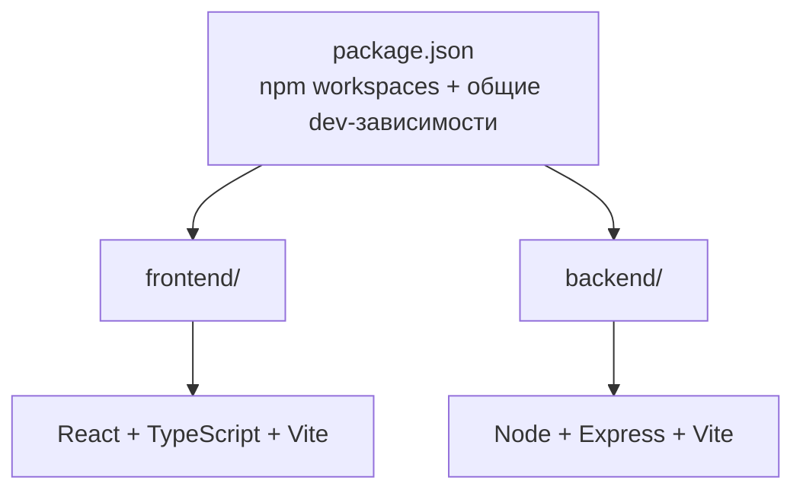

# Family — Web Application

Монорепозиторий веб-приложения: фронтенд на **React + TypeScript + Vite** и бэкенд на **Node.js + Express + Vite**. Управление зависимостями — через **npm workspaces** (общие dev-зависимости вынесены в корневой `package.json`).

## Структура проекта



```
.
├── package.json              # npm workspaces, общие скрипты и dev-зависимости
├── tsconfig.base.json        # общая конфигурация TypeScript
├── .prettierrc.json          # единый стиль кода
├── .gitignore
├── AGENTS.md                 # инструкции для ИИ-агентов (команды, правила, грабли)
├── .github/                  # кастомизации для ИИ-агентов
│   ├── agents/               # агенты (специализированные роли, выбор в чате)
│   │   ├── frontend-dev.agent.md     # фронтенд-разработчик (React/TS/Vite)
│   │   ├── backend-dev.agent.md      # бэкенд-разработчик (Express/SQLite)
│   │   └── fullstack-dev.agent.md    # сквозные фичи (бэкенд + фронтенд)
│   └── skills/               # скиллы (загружаются по запросу)
│       # Навыки project-renovation-* архивированы: projects/skills-archive/ (история)
│       ├── vps/              # VPS-мониторинг: SKILL.md, справочник, scripts/list-vps.mjs
│       ├── deploy/           # деплой и диагностика сервера: SKILL.md, справочник
│       ├── project-import/   # создание проекта (через UI/БД, не статика)
│       └── parse-pdf/        # конвертация PDF → HTML (общий, для любых проектов)
│       # Навыки project-renovation-* архивированы: projects/skills-archive/ (история)
├── README.md
├── docs/                     # спецификация и справочники (см. «Документация»)
│   ├── specification.md      # общая спецификация (SDD) + модульные specification-{vps,projects,auth,renovation,diary}.md
│   ├── immich.md             # справочник по интеграции с Immich (API, варианты, шаг 1 — админ-настройки)
│   └── server.md             # справочник по серверу/nginx/SSL/деплою
│
├── projects/                 # история «Ремонта» + архивированные навыки/агенты (приложением не используется)
│   ├── styles.css            # общий дизайн/тема статичных страниц проектов (история)
│   ├── theme.js              # тема (light/dark/system) для статичных страниц проектов (история)
│   ├── icon-sprite.svg       # общий SVG-спрайт иконок (история)
│   ├── renovation/           # статичный архив «Ремонта»: сметы, акты, заказы (история)
│   │   ├── index.html        # главная страница статичного архива (сводка: Работы/Материалы + Примечания)
│   │   ├── estimate_seed.html # исходная смета (никогда не меняется)
│   │   ├── estimate.html     # актуальная смета (обновляется по доп. соглашениям)
│   │   ├── estimate_*.html   # исторические копии сметы (по датам доп. соглашений)
│   │   ├── Reports/          # отчёты: report_work, report_materials (итоговый — на index.html)
│   │   ├── Materials/        # заказы материалов (report_*.html) + взаиморасчёты по материалам
│   │   └── Works/            # акты работ (act_*.html) + взаиморасчёты по работам
│   ├── skills-archive/       # архивированные навыки project-renovation-* (история)
│   └── agents-archive/       # архивированные агенты Projects Dev/Explorer (история)
│
├── frontend/                 # React + TypeScript + Vite
│   ├── package.json
│   ├── tsconfig.json
│   ├── vite.config.ts        # dev-порт 5173, proxy /api -> :3000
│   ├── index.html
│   ├── .env.example
│   └── src/
│       ├── main.tsx          # точка входа React
│       ├── App.tsx           # корневой компонент
│       ├── index.css         # глобальные стили
│       ├── api/              # HTTP-клиент (fetch к /api)
│       ├── components/       # переиспользуемые UI-компоненты
│       ├── hooks/            # пользовательские React-хуки (в т.ч. useAuth — авторизация)
│       ├── pages/            # страницы приложения (в т.ч. LoginPage — экран входа)
│       └── vite-env.d.ts
│
└── backend/                  # Node + Express + Vite
    ├── package.json
    ├── tsconfig.json
    ├── vite.config.ts        # dev-порт 3000, HMR через vite-plugin-node
    ├── .env.example
    ├── scripts/              # CLI: users.mjs (учётки), extract_pdf.py (импорт PDF «Ремонта»)
    └── src/
        ├── app.ts            # Express-приложение (экспорт app + автостарт при прямом запуске)
        ├── config/           # конфигурация окружения + типы VPS
        ├── db/               # SQLite (node:sqlite): соединения + репозитории (vps/auth/projects/renovation/diary/settings)
        ├── routes/           # маршруты API (в т.ч. auth — вход/выход/me, settings — админ-настройки)
        ├── controllers/      # обработчики запросов
        ├── services/         # бизнес-логика (VPS, авторизация; renovation/domain — данные «Ремонта»; diary — события; immich — проверка соединения)
        └── middlewares/      # middleware (ошибки, 404, requireAuth/requireAdmin, загрузка файлов)
```

## Установка

Требуется Node.js **20+** и npm **10+**.

```bash
npm install
```

## Запуск

| Команда                   | Описание                                                                    |
| ------------------------- | --------------------------------------------------------------------------- |
| `npm run dev`             | Запуск фронтенда и бэкенда одновременно                                     |
| `npm run dev:frontend`    | Только фронтенд (http://localhost:5173)                                     |
| `npm run dev:backend`     | Только бэкенд (http://localhost:3000)                                       |
| `npm run build`           | Сборка фронтенда и бэкенда                                                  |
| `npm start`               | Запуск собранного бэкенда (`backend/dist/app.cjs`)                          |
| `npm run typecheck`       | Проверка типов во всех воркспейсах                                          |
| `npm run format`          | Форматирование кода через Prettier                                          |
| `npm run user -w backend` | Управление пользователями авторизации (`add`, `list`, `set-role`, `remove`) |

## Как это работает

- **Фронтенд** запускается через Vite dev-сервер на порту `5173`. Запросы к `/api/*` проксируются на бэкенд (`vite.config.ts`), поэтому в разработке не нужен CORS.
- **Бэкенд** запускается через Vite c плагином `vite-plugin-node` — Express-приложение получает горячую перезагрузку при изменении кода. Приложение экспортируется из `src/app.ts`; при прямом запуске собранного `dist/app.cjs` (`npm start`) оно само стартует сервер на порту из `PORT`.
- **Хранилище VPS** — SQLite (встроенный `node:sqlite`, без новых зависимостей). Файл БД — `backend/data/vps.sqlite` (путь через `DB_PATH`), наполняется вручную, через форму добавления VPS в UI (`POST /api/vps`), редактируется по кнопке карандаша в модалке детализации (`PATCH /api/vps/:name`), импортом из JSON-файла структуры `vps.json` (`POST /api/vps/import`) или удаляется через кнопку-корзину (`DELETE /api/vps/:name`); схема таблиц создаётся автоматически при первом обращении. В git не попадает, при деплое не затирается.
- **Раздел «Проекты»** — все проекты прикладные (`kind: 'app'`): встроенный реестр `backend/src/config/appProjects.ts` («Ремонт») + записи БД `projects` (созданные через UI; отдельная БД `backend/data/projects.sqlite`, путь — `PROJECTS_DB_PATH`). Список динамический: `GET /api/projects` = реестр + БД (без сканирования файловой системы). Страницы проектов — маршруты приложения (`#/projects/<slug>`), наследуют стиль и тему приложения.
- **Данные «Ремонта» (этапы 1–7)** — отчётность в отдельной БД `backend/data/renovation.sqlite` (путь — `RENOVATION_DB_PATH`, не путать с `DB_PATH` — это базы разных модулей; у каждого домена своя БД в `backend/data/`, все сохраняются при деплое). Домен — `backend/src/services/renovation/domain/` (чистые типы + деньги в копейках). Наполнение — **штатное, через импорт PDF в приложении** (`POST /api/renovation/pdf` → черновик → подтверждение); seed из статичных HTML убран. Просмотр — read-API `/api/renovation/*` и страница `#/projects/renovation` (сводка Работы /
  Материалы + отчёты по ссылкам «Ход работ»/«Закупка материалов» — открываются в модальном окне). Импорт PDF (этап 3) — кнопка «Импорт PDF» на странице «Ремонт» (admin): `pdfplumber` через Python-subprocess, черновик → подтверждение; подтверждённый PDF сохраняется в `RENOVATION_DOCS_DIR` (по умолчанию `docs/renovation`, на сервере — `server/docs/renovation`, сохраняется при деплое) и раздаётся через `GET /api/renovation/docs/:file`; «Отчёт №N» в «Блоке 2. Материалы» и в отчёте «Материалы» — ссылки на исходные PDF, просмотр — встроенный pdf.js (`PdfViewerModal`). Доп. соглашения (этап 4) — кнопка «Доп. соглашение» (admin): дифф по наименованиям (было/стало, добавление/удаление), подтверждение → старая смета `current` замораживается как `history`, создаётся новая `current` с пересчитанными итогами (см. `docs/specification-renovation.md`).
- **Раздел «Дневник»** — события семьи в отдельной БД `backend/data/diary.sqlite` (путь — `DIARY_DB_PATH`): блоки с фотографиями, названием, датой (или периодом дат в pill) и кратким описанием. Пользователь переключает макет кнопками с иконками: «список» (по умолчанию, на всю ширину) и «карточки» (сетка на 3 столбца). Клик по блоку открывает страницу события (`#/diary/:id`) с полным содержимым (обложка, markdown-описание, фотографии на местах маркеров и галерея оставшихся файлов). В форме admin инструмент вставки показывает миниатюры с подписями «Фото N», вставляет в Markdown маркеры `` и убирает выбранную фотографию из списка. Добавление (кнопка «+») и редактирование («карандашик») — только admin: форма с загрузкой нескольких фотографий, выбором основной, периодом дат и markdown-описанием. Изображения сохраняются на сервере в `DIARY_IMAGES_DIR` (по умолчанию `images`; dev — `backend/images/`, сервер — `server/images/`) в уникальной подпапке `images/<folder>/` на каждое событие; каталог сохраняется при деплое (как `data/` и `docs/`). Раздача — `GET /api/diary/images/:folder/:file` (под авторизацией): в карточках/галерее — уменьшенное превью (WebP, `?preview=1`, генерируется `sharp` в подпапке `thumbs/`), полный размер в максимальном качестве — только при открытии изображения на весь экран.
- **Создание/изменение/удаление проектов** — на странице «Проекты» (admin): «Создать проект» → `POST /api/projects` (JSON `{slug, title, description, accent?, icon?, order?, content?}`); редактирование и удаление — `PATCH`/`DELETE /api/projects/:slug` (кнопки на карточке/странице, только для созданных через UI). Бэкенд пишет в БД `projects` (метаданные + markdown-контент), **файлов и папок не создаёт** — проект сразу появляется в списке и открывается по `#/projects/<slug>`, без деплоя. Встроенные проекты (реестр) редактировать/удалять нельзя.
- **Авторизация** — весь портал (SPA и API) закрыт входом: без сессии фронтенд показывает экран входа, API отвечает 401. Учётные записи хранятся в отдельной БД `backend/data/auth.sqlite` (таблицы `users` + `sessions`, путь — `AUTH_DB_PATH`), пароли — только хэши scrypt; вход/выход по httpOnly `SameSite=Lax` cookie (`sid`, в проде `Secure`). Роли: `admin` (управление VPS, создание проектов, управление пользователями) и `user` (чтение). Первый администратор создаётся при старте из `AUTH_BOOTSTRAP_PASSWORD` (если в БД нет пользователей), дальнейшие учётки — `npm run user -w backend` или админ-панель в приложении (по клику на бейдж «админ» в шапке). CLI входит в деплой (`server/scripts/users.mjs`), поэтому учётками можно управлять и прямо на сервере. Эндпоинты: `POST /api/auth/login`, `POST /api/auth/logout`, `GET /api/auth/me`, `PATCH /api/auth/profile`, админ-эндпоинты `/api/auth/admin/users*`. Имя и пароль своей учётки пользователь меняет сам на странице «Профиль» (по клику на имя в шапке).
- **Интеграция с Immich (шаги 1–2)** — **шаг 1 (подключение):** админ-страница «Настройки» (`#/admin/settings`, шестерёнка рядом с бейджем «админ»): адрес инстанса + API-ключ + кнопка «Проверить соединение» (`POST /api/settings/immich/check` → `GET <base>/server/about` с `x-api-key`). При успехе реквизиты сохраняются в БД (зелёная галочка возле адреса), при ошибке — не сохраняются (красный крест). Реквизиты хранятся в таблице `settings` основной БД (`DB_PATH`), API-ключ клиенту не возвращается. Настроенный адрес используется для ссылок «Фотоархив» (главная) и «Архив» (футер) — хук `useImmichSettings` (без захардкоженного URL; если адрес не задан, ссылки скрыты). **Шаг 2 (пикер-импорт, вариант B2):** в форме события «Дневника» (admin) кнопка «Из Immich» — выбор фото по диапазону дат съёмки и импорт оригиналов в событие как обычных файлов (прокси `/api/immich/*` под `requireAdmin`; дневник остаётся самодостаточным). Справочник по API Immich и план интеграции — `docs/immich.md`.
- **Общие dev-зависимости** (`typescript`, `vite`, `@vitejs/plugin-react`, `vite-plugin-node`, `@types/*`, `prettier`, `concurrently`) подняты в корневой `package.json`, рантайм-зависимости лежат в `frontend/` и `backend/` соответственно.

## Управление пользователями

Портал закрыт авторизацией: учётные записи хранятся в отдельной БД авторизации `backend/data/auth.sqlite` (таблицы `users` + `sessions`, путь — `AUTH_DB_PATH`), пароли — хэши scrypt (без новых зависимостей, `node:crypto`). Роли: `admin` (управление VPS, создание проектов, управление пользователями) и `user` (чтение). Отображаемое имя и пароль своей учётки пользователь меняет на странице «Профиль» (`PATCH /api/auth/profile`; смена пароля — с подтверждением текущим).

**Первый администратор** создаётся автоматически при старте бэкенда, если в `users` нет записей и в `.env` задан `AUTH_BOOTSTRAP_PASSWORD` (учётка `admin`; имя/отображаемое имя — `AUTH_BOOTSTRAP_USERNAME`/`AUTH_BOOTSTRAP_NAME`). После первого входа переменную рекомендуется убрать.

**Остальные учётки** — двумя способами:

1. **Админ-панель в приложении** — по клику на бейдж «админ» в шапке открывается страница «Пользователи» (`#/admin/users`, только для роли `admin`): список учётных записей, добавление пользователя (логин/имя/роль/пароль), принудительная смена пароля и удаление (кроме собственной учётки). API — `/api/auth/admin/users*`.
2. **CLI** `npm run user -w backend` (скрипт `backend/scripts/users.mjs`, работает без сборки, тот же формат хэша):

| Команда                                                     | Что делает                                                              |
| ----------------------------------------------------------- | ----------------------------------------------------------------------- |
| `add <username> <name> <admin\|user> [--password <пароль>]` | Создать пользователя (пароль можно ввести интерактивно, не эхонируется) |
| `list`                                                      | Список пользователей (username, имя, роль, дата создания)               |
| `set-role <username> <admin\|user>`                         | Сменить роль                                                            |
| `remove <username>`                                         | Удалить пользователя                                                    |

Пример (локально, из корня репозитория):

```bash
npm run user -w backend -- add mama Мама user --password 'пароль'
npm run user -w backend -- add papa Папа admin
npm run user -w backend -- list
```

**На сервере** скрипт входит в деплой (`server/scripts/users.mjs`). На текущих хостах `node` в PATH (`/usr/bin/node`), поэтому запускается напрямую; если `node` не в PATH — использовать полный путь к бинарю:

```bash
cd /var/www/my.rybnikov.su/server
node scripts/users.mjs add mama Мама user
```

## Конфигурация окружения (файлы `.env`)

В проекте три независимых «пространства» переменных окружения. У каждого есть шаблон `.env.example` (в git, документированный) и, при необходимости, реальный `.env` (в git не попадает). Реальные `.env` не переопределяют уже заданные переменные окружения процесса.

| Файл            | Кто читает                                  | Переменные                                                                                                                                                            |
| --------------- | ------------------------------------------- | --------------------------------------------------------------------------------------------------------------------------------------------------------------------- |
| Корневой `.env` | `scripts/deploy.mjs` (деплой)               | `DEPLOY_HOST`, `DEPLOY_USER`, `DEPLOY_PORT`, `DEPLOY_FRONTEND_DIR`, `DEPLOY_BACKEND_DIR`, `DEPLOY_PM2_APP`, `DEPLOY_NODE_PATH`, `DEPLOY_PM2_HOME`, `DEPLOY_PDF_SETUP` |
| `backend/.env`  | Бэкенд (`src/config/env.ts` через `dotenv`) | `PORT`, `CORS_ORIGIN`, `NODE_ENV`, `DB_PATH`, `AUTH_DB_PATH`, `PROJECTS_DB_PATH`, `AUTH_COOKIE_NAME`, `SESSION_TTL_HOURS`, `AUTH_BOOTSTRAP_*`, `RENOVATION_*`         |
| `frontend/.env` | Vite (только `VITE_*`)                      | `VITE_API_BASE_URL`                                                                                                                                                   |

- **Корневой `.env` / `.env.example`** — конфигурация **деплоя** (SSH-хост, пользователь, пути на сервере, имя pm2-приложения). Загружается `scripts/deploy.mjs` собственным мини-загрузчиком. Шаблон — `.env.example` в корне.
- **`backend/.env.example`** — конфигурация **рантайма бэкенда**: порт API (`PORT`), разрешённый CORS-origin (`CORS_ORIGIN`), окружение (`NODE_ENV`), пути к раздельным SQLite-базам (`DB_PATH` — `data/vps.sqlite`, БД VPS; `AUTH_DB_PATH` — `data/auth.sqlite`, авторизация; `PROJECTS_DB_PATH` — `data/projects.sqlite`, прикладные проекты), а также авторизация: `AUTH_COOKIE_NAME` (имя cookie сессии, `sid`), `SESSION_TTL_HOURS` (срок жизни сессии, 168 ч), `AUTH_BOOTSTRAP_PASSWORD`/`AUTH_BOOTSTRAP_USERNAME`/`AUTH_BOOTSTRAP_NAME` (создание первого администратора при старте, если в БД нет пользователей). Модуль «Ремонт» — `RENOVATION_DB_PATH`/`RENOVATION_DOCS_DIR` (каталог загруженных PDF)/`RENOVATION_PYTHON`/`RENOVATION_EXTRACT_SCRIPT`. В dev подхватывается `dotenv` из `backend/.env`; в проде — из `server/.env`, который сохраняется при деплое. Переменной `PROJECTS_DIR` больше нет — проекты хранятся в БД.
- **`frontend/.env.example`** — конфигурация **фронтенда**: только переменные с префиксом `VITE_`. `VITE_API_BASE_URL` задаёт базовый URL API (пусто → Vite dev-прокси `/api` → `:3000`), используется в `src/api/client.ts`.

Общее правило: `.env.example` — документированный шаблон в git; реальный `.env` — локальный/серверный, в git не попадает (см. `.gitignore`).

## Документация

Актуальные документы находятся в каталоге `docs/`:

| Файл                               | Назначение                                                                                                                                           |
| ---------------------------------- | ---------------------------------------------------------------------------------------------------------------------------------------------------- |
| `docs/specification.md`            | Общая спецификация (SDD): обзор, архитектура, конфигурация, ADR, карта файлов + указатель на модульные                                               |
| `docs/specification-api.md`        | Спецификация API: все эндпоинты, матрица доступа, форматы ответов, коды ошибок                                                                       |
| `docs/specification-vps.md`        | Спецификация модуля VPS-мониторинг (FR-1…FR-9, критерии, сценарии)                                                                                   |
| `docs/specification-projects.md`   | Спецификация модуля «Проекты» (FR-10, критерии, сценарии, проект «Ремонт»)                                                                           |
| `docs/specification-auth.md`       | Спецификация модуля «Авторизация» (FR-11, критерии, сценарии, управление пользователями)                                                             |
| `docs/specification-renovation.md` | Спецификация data-слоя модуля «Ремонт» (домен, отдельная БД, seed-импорт, верификация)                                                               |
| `docs/immich.md`                   | Справочник по интеграции с Immich (фотоархив): API внешнего сервиса, варианты использования для фото «Дневника», шаг 1 — админ-настройки подключения |
| `docs/server.md`                   | Справочник по серверу: пути, nginx, SSL, деплой, диагностика                                                                                         |

Помимо `docs/`, в корне есть `AGENTS.md` — инструкции для ИИ-агентов (команды, правила, типичные грабли). Специализированные рабочие процессы вынесены в `.github/`: скиллы `.github/skills/` (например, `vps` — VPS-мониторинг, `deploy` — деплой и диагностика сервера) и агенты `.github/agents/` (например, `frontend-dev`, `backend-dev` и `fullstack-dev` — разработка фронтенда, бэкенда и сквозных фич). Все конвенции кода (фронтенд/бэкенд) сосредоточены в `AGENTS.md`.

**Правило:** при внесении изменений в код (требования, схема конфига, API, поведение UI) необходимо **синхронно актуализировать документацию** в `docs/`: сначала обновляется соответствующая модульная спецификация (`docs/specification-*.md`; общий `docs/specification.md` — при изменении общих положений), затем код. Код считается корректным, если удовлетворяет критериям приёмки из модульной спецификации. Новые или изменившиеся конвенции и скиллы для агентов отражать также в `AGENTS.md` и `.github/skills/`.

## Проверка

После `npm run dev` откройте http://localhost:5173 — страница покажет статус бэкенда (ответ `/api/health`).

## Публикация

По умолчанию для публикации используется только пошаговый pipeline:

```powershell
npm run pipeline
```

Он сначала обновляет тестовый сервер, синхронизирует данные, выполняет sanity-тесты и только
после успеха публикует приложение на `my.rybnikov.su`. Прямой `npm run deploy` сохранён для
истории, ручной диагностики и специальных случаев.

## Исторический прямой деплой на my.rybnikov.su

Скрипт `scripts/deploy.mjs` (команда `npm run deploy`) собирает проект, загружает файлы по SSH
(scp) и разворачивает их на выбранном сервере без тестового этапа. Основной хост —
**my.rybnikov.su**; дополнительный тестовый хост — **test.rybnikov.su**.

| Что                                      | Куда на сервере                       |
| ---------------------------------------- | ------------------------------------- |
| Фронтенд (`frontend/dist`)               | `/var/www/my.rybnikov.su/public_html` |
| Бэкенд (`backend/dist` + `package.json`) | `/var/www/my.rybnikov.su/server`      |

После загрузки скрипт на сервере: обновляет файлы, ставит production-зависимости (`npm install --omit=dev`) и перезапускает приложение под `pm2` (`pm2 restart family-backend`, при первом запуске — `pm2 start dist/app.cjs`). Если `pm2` на сервере не установлен (или не виден в PATH), скрипт сам найдёт его в типовых местах либо установит глобально (`npm install -g pm2`).

**Очистка каталогов на сервере:**

- `/var/www/my.rybnikov.su/public_html` — сама папка **никогда не удаляется**. При деплое удаляются только файлы верхнего уровня (`index.html` и т.п.) и подпапка `assets/` (результат сборки Vite), а прочие подпапки (например `.well-known`) сохраняются.
- `/var/www/my.rybnikov.su/server` — папка не удаляется, содержимое очищается, **`.env`, `data/` (SQLite-базы), `docs/` (загруженные PDF «Ремонта») и `images/` (изображения «Дневника») сохраняются** (не перезаписываются и не удаляются).
- **`projects/` репозитория** (история «Ремонта» + архивированные навыки) на сервер не копируется; `server/renovation-source/` и seed «Ремонта» упразднены. Статичные страницы проектов деплой не зеркалирует (все проекты живут в приложении); статичный архив `public_html/projects/` на сервере удалён.

Посмотреть, что именно выполняется на сервере, без деплоя:

```bash
node scripts/deploy.mjs --print-script
```

```bash
npm run deploy                  # исторический прямой деплой
npm run deploy -- --no-build    # без локальной сборки
npm run deploy -- --no-restart  # без перезапуска pm2
```

### Пошаговая публикация через тестовый сервер

`npm run pipeline` выполняет этапы строго последовательно: публикует код на `test.rybnikov.su`,
заменяет на тестовом сервере базы из основного сервера, ждёт готовности `GET /api/health`,
запускает sanity-тесты и только при их успехе публикует тот же build на `my.rybnikov.su`.
При ошибке этапа основной сервер не меняется.

```powershell
npm run pipeline
```

Перед тестами pipeline создаёт временных пользователей `test` (`admin`, пароль `test123456`)
и `user` (`user`, пароль `user123456`). После завершения sanity они удаляются. Имена и пароли
можно переопределить через `PIPELINE_TEST_ADMIN_*` и `PIPELINE_TEST_USER_*`.

По умолчанию копируется только `data/` (включая SQLite WAL/SHM-файлы). Для синхронизации
загруженных PDF и изображений перед запуском задайте `PIPELINE_SYNC_FILES=1`. Конфигурацию без
сетевых действий можно посмотреть командой `npm run pipeline -- --print-config`.

#### Состав sanity-тестов

Набор находится в `scripts/sanity-test.mjs` и выполняет 7 проверок без изменения данных под
каждым из двух пользователей: `test` проверяет admin-доступ, `user` проверяет обычную роль.

1. `GET /api/health` отвечает `2xx` и возвращает `status: "ok"`.
2. Health-ответ сообщает `environment: "production"`.
3. `POST /api/auth/login` с credentials текущего тестового пользователя успешно входит.
4. Ответ входа содержит ожидаемого пользователя и cookie сессии.
5. Авторизованный `GET /api/auth/me` возвращает того же пользователя.
6. Авторизованные `GET /api/projects`, `/api/vps` и `/api/diary` возвращают массивы.
7. Авторизованный `GET /api/renovation` возвращает объект сводки.

Ошибочный HTTP-статус, неверный формат ответа, отсутствие cookie или несовпадение пользователя
завершают тесты с ненулевым кодом. Кратковременная сетевая ошибка `fetch` повторяется до трёх раз;
HTTP-ответы повторно не запрашиваются. В pipeline это блокирует публикацию на основной сервер.

### Настройка

Параметры задаются в корневом файле `.env` (загружается скриптом автоматически, в git не коммитится). Шаблон — `.env.example`:

```bash
DEPLOY_HOST=my.rybnikov.su      # SSH host (основной)
DEPLOY_USER=rybnikov            # SSH user
DEPLOY_PORT=22                  # SSH port
DEPLOY_FRONTEND_DIR=/var/www/my.rybnikov.su/public_html
DEPLOY_BACKEND_DIR=/var/www/my.rybnikov.su/server
DEPLOY_PM2_APP=family-backend   # pm2 app name
DEPLOY_PM2_HOME=/home/rybnikov/.pm2   # стабильный PM2_HOME на сервере (обязательно)
DEPLOY_PDF_SETUP=0    # не готовить сервер к импорту PDF (venv ставится вручную; см. docs/server.md §1.4)

# Optional: bin directory with node/npm ON THE SERVER, if the remote script
# cannot auto-detect them (e.g. /home/rybnikov/.nvm/versions/node/v24.19.0/bin)
# DEPLOY_NODE_PATH=
```

`DEPLOY_PM2_HOME` — абсолютный путь для pm2 на сервере. **Обязателен:** Windows-клиент OpenSSH шлёт на сервер `HOME=C:Usersalex`, и без `PM2_HOME` демон pm2 резолвится относительно CWD и становится нестабильным. Задаётся также в `.env`.

Тестовый хост (дополнительный):

```powershell
$env:DEPLOY_HOST = "test.rybnikov.su"; $env:DEPLOY_USER = "rybnikov"
$env:DEPLOY_FRONTEND_DIR = "/var/www/test.rybnikov.su/public_html"
$env:DEPLOY_BACKEND_DIR = "/var/www/test.rybnikov.su/server"
$env:DEPLOY_PM2_APP = "family-backend-test"; $env:DEPLOY_PM2_HOME = "/home/rybnikov/.pm2"
npm run deploy -- --no-pdf-setup
```

> `--no-pdf-setup` на новых хостах обязателен: из-за грабли `HOME` (см. docs/server.md §4.1) pdf-setup создаёт venv по битому пути; venv ставится вручную.

В неинтерактивной SSH-сессии PATH часто минимален, поэтому Node.js, установленный через nvm или в нестандартный каталог, может быть не виден. Серверный скрипт сам ищет `node`/`npm`: подключает профили пользователя (`~/.profile`, `~/.bashrc`, `nvm.sh`) и проверяет типовые пути (`~/.nvm/...`, `/usr/local/bin`, `/usr/bin` и др.). Если этого мало — задайте `DEPLOY_NODE_PATH` (каталог с `node`/`npm` на сервере).

Проверить итоговую конфигурацию без деплоя:

```bash
node scripts/deploy.mjs --print-config
```

Пример с другим пользователем и портом (PowerShell, переменные окружения имеют приоритет над `.env`):

```powershell
$env:DEPLOY_USER = "ubuntu"; $env:DEPLOY_PORT = "2222"; npm run deploy
```

### Требования

- На машине разработки установлен OpenSSH-клиент (`ssh`/`scp`) — встроен в Windows 10+.
- Рекомендуется настроить **SSH-ключ** (`ssh-keygen` + `ssh-copy-id`), чтобы деплой шёл без запросов пароля. Пароль/ключ нигде не хранятся — скрипт только вызывает ssh/scp.
- На сервере установлены `node`/`npm` и `pm2`, а также `.env` в `/var/www/my.rybnikov.su/server` с нужными значениями (`PORT`, `CORS_ORIGIN=https://my.rybnikov.su` и т.д.).
- Для отдачи статики фронтенда и проксирования `/api` на порт бэкенда на сервере должен быть настроен веб-сервер (например, nginx). На основном хосте настроены редиректы: `family.rybnikov.su` (CNAME на `my.rybnikov.su` — активен) и `rybnikov.su` (после перевода DNS) → `https://my.rybnikov.su`, а также `http → https`.
- **`sharp` зафиксирован `~0.35.3`** (последняя версия, работает на новом сервере с CPU AVX2; прежний пин `~0.33.5` был нужен из-за слабого CPU старого сервера).
