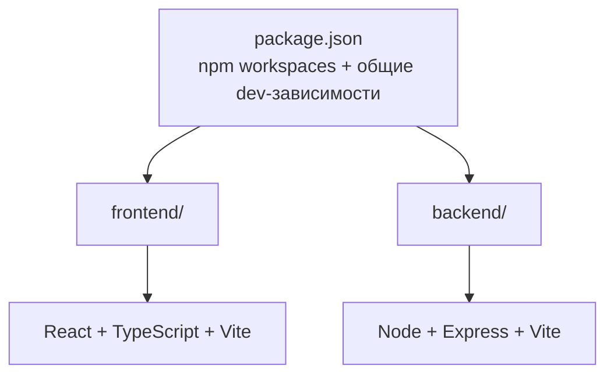

# Family — Web Application

Монорепозиторий веб-приложения: фронтенд на **React + TypeScript + Vite** и бэкенд на **Node.js + Express + Vite**. Управление зависимостями — через **npm workspaces** (общие dev-зависимости вынесены в корневой `package.json`).

## Структура проекта


```mermaid
graph TD
  A[package.json<br/>npm workspaces + общие dev-зависимости] --> B[frontend/]
  A --> C[backend/]
  B --> D[React + TypeScript + Vite]
  C --> E[Node + Express + Vite]
```

```
.
├── package.json              # npm workspaces, общие скрипты и dev-зависимости
├── tsconfig.base.json        # общая конфигурация TypeScript
├── .prettierrc.json          # единый стиль кода
├── .gitignore
├── AGENTS.md                 # инструкции для ИИ-агентов (команды, правила, грабли)
├── .github/                  # кастомизации для ИИ-агентов
│   ├── agents/               # агенты (специализированные роли, выбор в чате)
│   │   ├── frontend-dev.agent.md     # фронтенд-разработчик (React/TS/Vite)
│   │   ├── backend-dev.agent.md      # бэкенд-разработчик (Express/SQLite)
│   │   └── fullstack-dev.agent.md    # сквозные фичи (бэкенд + фронтенд)
│   ├── skills/               # скиллы (загружаются по запросу)
│       ├── vps/              # VPS-мониторинг: SKILL.md, справочник, scripts/list-vps.mjs
│       ├── deploy/           # деплой и диагностика сервера: SKILL.md, справочник
│       ├── project-import/   # создание проекта (через UI/БД, не статика)
│       └── harness-init/     # каркас харнесса и спецификации для нового проекта (SKILL.md + шаблоны references/*)
│       # Архивные навыки (parse-pdf, project-renovation-*): projects/skills-archive/ (история)
│   └── prompts/              # prompt-обертки для задач инициализации
├── README.md
├── docs/                     # спецификация и справочники (см. «Документация»)
│   ├── guardrails.md         # обязательные ограничения проекта
│   ├── specification.md      # общий индекс спецификаций
│   ├── layers/               # технические слои и дизайн-система фронтенда
│   ├── domains/              # спецификации VPS, projects, auth, diary, renovation
│   ├── adr/                 # архитектурные решения
│   ├── cj/                   # customer journeys
│   ├── fr/                   # functional requirements
│   ├── nfr/                  # non-functional requirements
│   ├── hr/                   # harness requirements
│   ├── integrations/         # внешние сервисы и их интеграция
│   ├── operations/           # production, backup и restore
│   ├── policies/             # внешние ценовые и модельные политики
│   └── traceability.md       # связи требований, реализации и проверок
│
├── projects/                 # история «Ремонта» + архивированные навыки/агенты (приложением не используется)
│   ├── styles.css            # общий дизайн/тема статичных страниц проектов (история)
│   ├── theme.js              # тема (light/dark/system) для статичных страниц проектов (история)
│   ├── icon-sprite.svg       # общий SVG-спрайт иконок (история)
│   ├── renovation/           # статичный архив «Ремонта»: сметы, акты, заказы (история)
│   │   ├── index.html        # главная страница статичного архива (сводка: Работы/Материалы + Примечания)
│   │   ├── estimate_seed.html # исходная смета (никогда не меняется)
│   │   ├── estimate.html     # актуальная смета (обновляется по доп. соглашениям)
│   │   ├── estimate_*.html   # исторические копии сметы (по датам доп. соглашений)
│   │   ├── Reports/          # отчёты: report_work, report_materials (итоговый — на index.html)
│   │   ├── Materials/        # заказы материалов (report_*.html) + взаиморасчёты по материалам
│   │   └── Works/            # акты работ (act_*.html) + взаиморасчёты по работам
│   ├── skills-archive/       # архивированные навыки: parse-pdf, project-renovation-* (история)
│   └── agents-archive/       # архивированные агенты Projects Dev/Explorer (история)
│
├── frontend/                 # React + TypeScript + Vite
│   ├── package.json
│   ├── tsconfig.json
│   ├── vite.config.ts        # dev-порт 5173, proxy /api -> :3000
│   ├── index.html
│   ├── .env.example
│   └── src/
│       ├── main.tsx          # точка входа React
│       ├── App.tsx           # корневой компонент
│       ├── index.css         # глобальные стили
│       ├── api/              # HTTP-клиент (fetch к /api)
│       ├── components/       # переиспользуемые UI-компоненты
│       ├── hooks/            # пользовательские React-хуки (в т.ч. useAuth — авторизация)
│       ├── pages/            # страницы приложения (в т.ч. LoginPage — экран входа)
│       └── vite-env.d.ts
│
└── backend/                  # Node + Express + Vite
    ├── package.json
    ├── tsconfig.json
    ├── vite.config.ts        # dev-порт 3000, HMR через vite-plugin-node
    ├── .env.example
    ├── scripts/              # CLI: users.mjs (учётки), extract_pdf.py (импорт PDF «Ремонта»)
    └── src/
        ├── app.ts            # Express-приложение (экспорт app + автостарт при прямом запуске)
        ├── config/           # конфигурация окружения + типы VPS
        ├── db/               # SQLite (node:sqlite): соединения + репозитории (vps/auth/projects/renovation/diary/settings)
        ├── routes/           # маршруты API (в т.ч. auth — вход/выход/me, settings — админ-настройки)
        ├── controllers/      # обработчики запросов
        ├── services/         # бизнес-логика (VPS, авторизация; renovation/domain — данные «Ремонта»; diary — события; immich — проверка соединения)
        └── middlewares/      # middleware (ошибки, 404, requireAuth/requireAdmin, загрузка файлов)
```

## Установка

Требуется Node.js **≥ 22.5** и npm **10+** (бэкенд использует встроенный `node:sqlite`).

```bash
npm install
```

## Запуск

| Команда                    | Описание                                                                    |
| -------------------------- | --------------------------------------------------------------------------- |
| `npm run dev`              | Запуск фронтенда и бэкенда одновременно                                     |
| `npm run dev:frontend`     | Только фронтенд (http://localhost:5173)                                     |
| `npm run dev:backend`      | Только бэкенд (http://localhost:3000)                                       |
| `npm run build`            | Сборка фронтенда и бэкенда                                                  |
| `npm run start -w backend` | Запуск собранного бэкенда (`backend/dist/app.cjs`)                          |
| `npm run typecheck`        | Проверка типов во всех воркспейсах                                          |
| `npm run docs:check`       | Проверка полноты индексов CJ/FR и матрицы трассировки                        |
| `npm run format`           | Форматирование кода через Prettier                                          |
| `npm run user -w backend`  | Управление пользователями авторизации (`add`, `list`, `set-role`, `remove`) |

## Как это работает

- **Фронтенд** запускается через Vite dev-сервер на порту `5173`. Запросы к `/api/*` проксируются на бэкенд (`vite.config.ts`), поэтому в разработке не нужен CORS.
- **Бэкенд** запускается через Vite c плагином `vite-plugin-node` — Express-приложение получает горячую перезагрузку при изменении кода. Приложение экспортируется из `src/app.ts`; при прямом запуске собранного `dist/app.cjs` (`npm run start -w backend`) оно само стартует сервер на порту из `PORT`.
- **Продуктовые модули:** [VPS](docs/domains/vps.md), [Проекты](docs/domains/projects.md), [Планы](docs/domains/plans.md), [Поиск](docs/domains/search.md), [Авторизация](docs/domains/auth.md), [Ремонт](docs/domains/renovation.md) и [Дневник](docs/domains/diary.md) — владельцы поведения, данных и критериев приемки.
- **Архитектура и API:** [слои](docs/layers/) описывают backend/frontend и сквозные контракты; [HTTP API](docs/layers/api.md) — матрицу доступа и форматы обмена.
- **Внешняя интеграция:** [Immich](docs/integrations/immich.md) настраивается администратором; пикер импортирует выбранные оригиналы в самостоятельное хранилище «Дневника».
- **Эксплуатация и ограничения:** [server operations](docs/operations/server.md), [backup/restore](docs/operations/backup.md) и [DeepSeek pricing policy](docs/policies/deepseek-pricing.md) имеют отдельные документы-владельцы.

## Управление пользователями

Портал закрыт авторизацией: учётные записи хранятся в отдельной БД авторизации `backend/data/auth.sqlite` (таблицы `users` + `sessions`, путь — `AUTH_DB_PATH`), пароли — хэши scrypt (без новых зависимостей, `node:crypto`). Роли: `admin` (управление VPS, создание проектов, управление пользователями) и `user` (чтение). Отображаемое имя и пароль своей учётки пользователь меняет на странице «Профиль» (`PATCH /api/auth/profile`; смена пароля — с подтверждением текущим).

**Первый администратор** создаётся автоматически при старте бэкенда, если в `users` нет записей и в `.env` задан `AUTH_BOOTSTRAP_PASSWORD` (учётка `admin`; имя/отображаемое имя — `AUTH_BOOTSTRAP_USERNAME`/`AUTH_BOOTSTRAP_NAME`). После первого входа переменную рекомендуется убрать.

**Остальные учётки** — двумя способами:

1. **Админ-панель в приложении** — по клику на бейдж «админ» в шапке открывается страница «Пользователи» (`#/admin/users`, только для роли `admin`): список учётных записей, добавление пользователя (логин/имя/роль/пароль), принудительная смена пароля и удаление (кроме собственной учётки). API — `/api/auth/admin/users*`.
2. **CLI** `npm run user -w backend` (скрипт `backend/scripts/users.mjs`, работает без сборки, тот же формат хэша):

| Команда                                                     | Что делает                                                              |
| ----------------------------------------------------------- | ----------------------------------------------------------------------- |
| `add <username> <name> <admin\|user> [--password <пароль>]` | Создать пользователя (пароль можно ввести интерактивно, не эхонируется) |
| `list`                                                      | Список пользователей (username, имя, роль, дата создания)               |
| `set-role <username> <admin\|user>`                         | Сменить роль                                                            |
| `remove <username>`                                         | Удалить пользователя                                                    |

Пример (локально, из корня репозитория):

```bash
npm run user -w backend -- add mama Мама user --password 'пароль'
npm run user -w backend -- add papa Папа admin
npm run user -w backend -- list
```

**На сервере** скрипт входит в деплой (`server/scripts/users.mjs`). На текущих хостах `node` в PATH (`/usr/bin/node`), поэтому запускается напрямую; если `node` не в PATH — использовать полный путь к бинарю:

```bash
cd /var/www/my.rybnikov.su/server
node scripts/users.mjs add mama Мама user
```

## Конфигурация окружения (файлы `.env`)

В проекте три независимых «пространства» переменных окружения. У каждого есть шаблон `.env.example` (в git, документированный) и, при необходимости, реальный `.env` (в git не попадает). Реальные `.env` не переопределяют уже заданные переменные окружения процесса.

| Файл            | Кто читает                                  | Переменные                                                                                                                                                                                         |
| --------------- | ------------------------------------------- | -------------------------------------------------------------------------------------------------------------------------------------------------------------------------------------------------- |
| Корневой `.env` | `scripts/deploy.mjs` (деплой)               | `DEPLOY_HOST`, `DEPLOY_USER`, `DEPLOY_PORT`, `DEPLOY_FRONTEND_DIR`, `DEPLOY_BACKEND_DIR`, `DEPLOY_PM2_APP`, `DEPLOY_NODE_PATH`, `DEPLOY_PM2_HOME`, `DEPLOY_PDF_SETUP`                              |
| `backend/.env`  | Бэкенд (`src/config/env.ts` через `dotenv`) | `PORT`, `CORS_ORIGIN`, `NODE_ENV`, `DB_PATH`, `AUTH_DB_PATH`, `PROJECTS_DB_PATH`, `PLANS_DB_PATH`, `AUTH_COOKIE_NAME`, `SESSION_TTL_HOURS`, `AUTH_BOOTSTRAP_*`, `RENOVATION_*`, `DIARY_DB_PATH`, `DIARY_IMAGES_DIR` |
| `frontend/.env` | Vite (только `VITE_*`)                      | `VITE_API_BASE_URL`                                                                                                                                                                                |

- **Корневой `.env` / `.env.example`** — конфигурация **деплоя** (SSH-хост, пользователь, пути на сервере, имя pm2-приложения). Загружается `scripts/deploy.mjs` собственным мини-загрузчиком. Шаблон — `.env.example` в корне.
- **`backend/.env.example`** — конфигурация **рантайма бэкенда**: порт API (`PORT`), разрешённый CORS-origin (`CORS_ORIGIN`), окружение (`NODE_ENV`), пути к раздельным SQLite-базам (`DB_PATH` — `data/vps.sqlite`, БД VPS; `AUTH_DB_PATH` — `data/auth.sqlite`, авторизация; `PROJECTS_DB_PATH` — `data/projects.sqlite`, прикладные проекты; `PLANS_DB_PATH` — `data/plans.sqlite`, задачи), а также авторизация: `AUTH_COOKIE_NAME` (имя cookie сессии, `sid`), `SESSION_TTL_HOURS` (срок жизни сессии, 168 ч), `AUTH_BOOTSTRAP_PASSWORD`/`AUTH_BOOTSTRAP_USERNAME`/`AUTH_BOOTSTRAP_NAME` (создание первого администратора при старте, если в БД нет пользователей). Модуль «Ремонт» — `RENOVATION_DB_PATH`/`RENOVATION_DOCS_DIR` (каталог загруженных PDF)/`RENOVATION_PYTHON`/`RENOVATION_EXTRACT_SCRIPT`; модуль «Дневник» — `DIARY_DB_PATH` (БД событий)/`DIARY_IMAGES_DIR` (каталог изображений). В dev подхватывается `dotenv` из `backend/.env`; в проде — из `server/.env`, который сохраняется при деплое. Переменной `PROJECTS_DIR` больше нет — проекты хранятся в БД.
- **`frontend/.env.example`** — конфигурация **фронтенда**: только переменные с префиксом `VITE_`. `VITE_API_BASE_URL` задаёт базовый URL API (пусто → Vite dev-прокси `/api` → `:3000`), используется в `src/api/client.ts`.

Общее правило: `.env.example` — документированный шаблон в git; реальный `.env` — локальный/серверный, в git не попадает (см. `.gitignore`).

## Документация

Актуальные документы находятся в каталоге `docs/`:

| Файл                               | Назначение                                                                                                                                           |
| ---------------------------------- | ---------------------------------------------------------------------------------------------------------------------------------------------------- |
| `docs/specification.md`            | Общая спецификация и индекс архитектуры                                                                                                              |
| `docs/layers/backend.md`           | Backend-архитектура, конфигурация и владельцы хранилищ                                                                                               |
| `docs/layers/middleware.md`        | Сквозная обработка запросов, доступ, загрузка и ошибки                                                                                              |
| `docs/layers/frontend.md`          | Frontend-архитектура, маршруты, API-клиент и состояние                                                                                              |
| `docs/layers/api.md`               | HTTP API: endpoints, матрица доступа, форматы ответов и коды ошибок                                                                                 |
| `docs/domains/vps.md`              | Домен VPS-мониторинга (FR-1…FR-9, критерии и сценарии)                                                                                              |
| `docs/domains/projects.md`         | Домен «Проекты» (FR-10, критерии и сценарии)                                                                                                        |
| `docs/domains/auth.md`             | Домен авторизации (FR-11, роли, сессии и управление пользователями)                                                                                 |
| `docs/domains/renovation.md`       | Домен «Ремонт»: БД, импорт PDF, доп. соглашения и отчеты                                                                                            |
| `docs/domains/diary.md`            | Домен «Дневник»: события, БД, изображения и редакторы                                                                                               |
| `docs/adr/index.md`                | Индекс ADR; каждый ADR хранится отдельным `adr-xxx-short-name.md`                                                                                   |
| `docs/cj/index.md`                 | Индекс customer journeys; записи `cj-xxx-short-name.md`                                                                                            |
| `docs/fr/index.md`                 | Индекс функциональных требований; записи `fr-xxx-short-name.md`                                                                                   |
| `docs/nfr/index.md`                | Индекс нефункциональных требований; записи `nfr-xxx-short-name.md`                                                                                |
| `docs/hr/index.md`                 | Индекс требований к харнессу; записи `hr-xxx-short-name.md`                                                                                        |
| `docs/traceability.md`             | Матрица связи journeys, требований, реализации и проверок                                                                                            |
| `docs/layers/design-system.md`     | Дизайн-система фронтенда: токены, шкалы, примитивы, адаптивность и визуальная проверка                                                               |
| `docs/integrations/immich.md`      | Справочник интеграции Immich: внешний API и использование в приложении                                                                             |
| `docs/policies/deepseek-pricing.md`| Ценовая политика DeepSeek API (peak/off-peak) и gate перед использованием модели                                                                   |
| `docs/operations/server.md`        | Production-сервер: пути, nginx, SSL, деплой и диагностика                                                                                           |
| `docs/operations/backup.md`        | Backup/restore: команды, конфигурация `BACKUP_*`/`RESTORE_*`, cron и восстановление на новый VPS                                                   |

Помимо `docs/`, в корне есть `AGENTS.md` — инструкции для ИИ-агентов (команды, правила, типичные грабли). Специализированные рабочие процессы вынесены в `.github/`: скиллы `.github/skills/` (например, `vps` — VPS-мониторинг, `deploy` — деплой и диагностика сервера), агенты `.github/agents/` (например, `frontend-dev`, `backend-dev` и `fullstack-dev` — разработка фронтенда, бэкенда и сквозных фич) и промпты `.github/prompts/` (повторяемые задачи; например, `init-harness` — инициализация харнесса и спецификации в новом монорепозитории по шаблонам навыка `.github/skills/harness-init/`). Все конвенции кода (фронтенд/бэкенд) сосредоточены в `AGENTS.md`.

**Правило:** при внесении изменений в код синхронно обновляй затронутые спецификации: поведение продукта — в `docs/domains/`, cross-layer контракты и архитектуру — в `docs/layers/`, общий индекс — в `docs/specification.md` только при изменении карты или общих положений. Код корректен, если соответствует критериям приемки доменной спецификации. Новые конвенции отражай также в `AGENTS.md` и `.github/skills/`.

## Проверка

После `npm run dev` откройте http://localhost:5173 — страница покажет статус бэкенда (ответ `/api/health`).

## Публикация

Публикация выполняется напрямую на основной сервер:

```powershell
npm run deploy -- --no-pdf-setup
```

Скрипт `scripts/deploy.mjs` собирает проект, загружает файлы по SSH (scp) и разворачивает их на
`my.rybnikov.su`. `--no-pdf-setup` отключает настройку Python-окружения для импорта PDF;
удалите этот флаг, только если необходимо выполнить эту настройку на сервере.

| Что                                      | Куда на сервере                       |
| ---------------------------------------- | ------------------------------------- |
| Фронтенд (`frontend/dist`)               | `/var/www/my.rybnikov.su/public_html` |
| Бэкенд (`backend/dist` + `package.json`) | `/var/www/my.rybnikov.su/server`      |

После загрузки скрипт на сервере: обновляет файлы, ставит production-зависимости (`npm install --omit=dev`) и перезапускает приложение под `pm2` (`pm2 restart family-backend`, при первом запуске — `pm2 start dist/app.cjs`). Если `pm2` на сервере не установлен (или не виден в PATH), скрипт сам найдёт его в типовых местах либо установит глобально (`npm install -g pm2`).

**Очистка каталогов на сервере:**

- `/var/www/my.rybnikov.su/public_html` — сама папка **никогда не удаляется**. При деплое удаляются только файлы верхнего уровня (`index.html` и т.п.) и подпапка `assets/` (результат сборки Vite), а прочие подпапки (например `.well-known`) сохраняются.
- `/var/www/my.rybnikov.su/server` — папка не удаляется, содержимое очищается, **`.env`, `data/` (SQLite-базы), `docs/` (загруженные PDF «Ремонта») и `images/` (изображения «Дневника») сохраняются** (не перезаписываются и не удаляются).
- **`projects/` репозитория** (история «Ремонта» + архивированные навыки) на сервер не копируется; `server/renovation-source/` и seed «Ремонта» упразднены. Статичные страницы проектов деплой не зеркалирует (все проекты живут в приложении); статичный архив `public_html/projects/` на сервере удалён.

Посмотреть, что именно выполняется на сервере, без деплоя:

```bash
node scripts/deploy.mjs --print-config
node scripts/deploy.mjs --print-script
```

```bash
npm run deploy -- --no-pdf-setup # публикация на my.rybnikov.su
npm run deploy -- --no-build    # без локальной сборки
npm run deploy -- --no-restart  # без перезапуска pm2
```

### Sanity-проверки API

Read-only проверки можно запустить отдельно после публикации. Задайте `SANITY_USERNAME` и
`SANITY_PASSWORD`; URL по умолчанию — `https://my.rybnikov.su`, переопределяется через
`SANITY_BASE_URL`.

```powershell
npm run sanity:test
```

## Бэкап и восстановление

`npm run backup` создаёт архив **невосстановимого из git** на основном сервере: `data/`
(5 SQLite-БД), `docs/` (PDF «Ремонта»), `images/` (фото «Дневника»), `server/.env`, плюс
справочные конфиги nginx/letsencrypt (не восстанавливаются). Код приложения в архив не входит —
он восстанавливается `npm run deploy`. Бэкап на несколько секунд останавливает бэкенд
(согласованный снапшот SQLite WAL); перезапуск гарантирован даже при сбое.

```powershell
npm run backup                      # архив на сервере + скачивание в backups/ + сверка sha256
npm run backup -- --local D:\backup # скачивание в конкретную локальную папку
npm run backup -- --remote-only     # оставить архив только на сервере
npm run backup -- --install-cron    # ежедневный cron-бэкап на сервере (ротация BACKUP_KEEP)
```

Восстановление на новый VPS (после провижининга nginx/SSL/node — чек-лист в `docs/operations/backup.md`):

```powershell
npm run restore -- C:\backup\family-backup-my.rybnikov.su-20260821-030000.tar.gz --host new.vps.example
npm run deploy   # затем код приложения (с DEPLOY_HOST на целевой хост)
```

`npm run restore -- <архив> --no-env` восстанавливает только `data/docs/images`, не трогая `.env`
цели (прежний `.env` всегда сохраняется в страховку).

Подробности и конфигурация (`BACKUP_*`/`RESTORE_*`) — в `docs/operations/backup.md` и `.env.example`.

### Настройка

Параметры задаются в корневом файле `.env` (загружается скриптом автоматически, в git не коммитится). Шаблон — `.env.example`:

```bash
DEPLOY_HOST=my.rybnikov.su      # SSH host (основной)
DEPLOY_USER=rybnikov            # SSH user
DEPLOY_PORT=22                  # SSH port
DEPLOY_FRONTEND_DIR=/var/www/my.rybnikov.su/public_html
DEPLOY_BACKEND_DIR=/var/www/my.rybnikov.su/server
DEPLOY_PM2_APP=family-backend   # pm2 app name
DEPLOY_PM2_HOME=/home/rybnikov/.pm2   # стабильный PM2_HOME на сервере (обязательно)
DEPLOY_PDF_SETUP=0    # не готовить сервер к импорту PDF (venv ставится вручную; см. docs/operations/server.md §1.4)

# Optional: bin directory with node/npm ON THE SERVER, if the remote script
# cannot auto-detect them (на текущих хостах node уже в PATH: /usr/bin)
# DEPLOY_NODE_PATH=
```

`DEPLOY_PM2_HOME` — абсолютный путь для pm2 на сервере. **Обязателен:** Windows-клиент OpenSSH шлёт на сервер `HOME=C:Usersalex`, и без `PM2_HOME` демон pm2 резолвится относительно CWD и становится нестабильным. Задаётся также в `.env`.

В неинтерактивной SSH-сессии PATH часто минимален, поэтому Node.js, установленный через nvm или в нестандартный каталог, может быть не виден. Серверный скрипт сам ищет `node`/`npm`: подключает профили пользователя (`~/.profile`, `~/.bashrc`, `nvm.sh`) и проверяет типовые пути (`~/.nvm/...`, `/usr/local/bin`, `/usr/bin` и др.). Если этого мало — задайте `DEPLOY_NODE_PATH` (каталог с `node`/`npm` на сервере).

Проверить итоговую конфигурацию без деплоя:

```bash
node scripts/deploy.mjs --print-config
```

Пример с другим пользователем и портом (PowerShell, переменные окружения имеют приоритет над `.env`):

```powershell
$env:DEPLOY_USER = "ubuntu"; $env:DEPLOY_PORT = "2222"; npm run deploy
```

### Требования

- На машине разработки установлен OpenSSH-клиент (`ssh`/`scp`) — встроен в Windows 10+.
- Рекомендуется настроить **SSH-ключ** (`ssh-keygen` + `ssh-copy-id`), чтобы деплой шёл без запросов пароля. Пароль/ключ нигде не хранятся — скрипт только вызывает ssh/scp.
- На сервере установлены `node`/`npm` и `pm2`, а также `.env` в `/var/www/my.rybnikov.su/server` с нужными значениями (`PORT`, `CORS_ORIGIN=https://my.rybnikov.su` и т.д.).
- Для отдачи статики фронтенда и проксирования `/api` на порт бэкенда на сервере должен быть настроен веб-сервер (например, nginx). На основном хосте настроены редиректы: `family.rybnikov.su` (CNAME на `my.rybnikov.su` — активен) и `rybnikov.su` (после перевода DNS) → `https://my.rybnikov.su`, а также `http → https`.
- **`sharp` зафиксирован `~0.35.3`** (последняя версия, работает на новом сервере с CPU AVX2; прежний пин `~0.33.5` был нужен из-за слабого CPU старого сервера).
