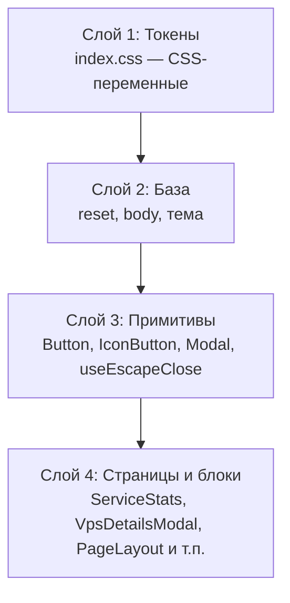

# Дизайн-система фронтенда

Справочник по дизайн-системе портала `family` (React 19 + TypeScript + Vite, `frontend/src/`).

Цель — единые токены и UI-примитивы вместо разрозненных классов в `index.css`: меньше дублей,
проще поддерживать темы (light/dark) и доступность. Система вводится постепенно, без изменения
API-контрактов и UI-поведения (Фазы 0–1 реализованы, следующие — в плане ниже).

## Слои



## Токены

Объявлены в `index.css` в блоках `:root` (светлая тема) и `[data-theme='dark']`.

### Семантические цвета статусов (одинаковы для обеих тем)

| Токен                                           | Значение               | Назначение                       |
| ----------------------------------------------- | ---------------------- | -------------------------------- |
| `--color-success`                               | `#22c55e`              | Индикатор «доступно» (точка)     |
| `--color-success-strong`                        | `#16a34a`              | Текст успеха на светлой подложке |
| `--color-success-bg`                            | `rgba(34,197,94,.1)`   | Подложка заметки/бейджа успеха   |
| `--color-success-halo`                          | `rgba(34,197,94,.15)`  | Кольцо точки/бейджа успеха       |
| `--color-success-border`                        | `rgba(34,197,94,.25)`  | Рамка заметки успеха             |
| `--color-warning`                               | `#f59e0b`              | Индикатор «проверка/неизвестно»  |
| `--color-warning-strong`                        | `#d97706`              | Текст предупреждения (янтарь)    |
| `--color-warning-bg` / `--color-warning-halo`   | `rgba(245,158,11,.15)` | Подложка/кольцо предупреждения   |
| `--color-critical`                              | `#f97316`              | Индикатор «частично недоступно»  |
| `--color-critical-strong`                       | `#ea580c`              | Текст частичной недоступности    |
| `--color-critical-bg` / `--color-critical-halo` | `rgba(249,115,22,.15)` | Подложка/кольцо критического     |
| `--color-danger`                                | `#ef4444`              | Индикатор «ошибка/недоступно»    |
| `--color-danger-strong`                         | `#dc2626`              | Текст ошибки                     |
| `--color-danger-bg`                             | `rgba(239,68,68,.1)`   | Подложка ошибки                  |
| `--color-danger-bg-strong`                      | `rgba(239,68,68,.12)`  | Подложка опасного hover          |
| `--color-danger-halo`                           | `rgba(239,68,68,.15)`  | Кольцо точки/бейджа ошибки       |
| `--color-danger-border`                         | `rgba(239,68,68,.25)`  | Рамка ошибки                     |

### Акценты разделов/страниц

| Токен                          | Значение  | Где используется                                          |
| ------------------------------ | --------- | --------------------------------------------------------- |
| `--color-accent-teal`          | `#14b8a6` | Иконка страницы «Новости», бейдж новости                  |
| `--color-accent-sky`           | `#0ea5e9` | Иконка страницы «Проекты»                                 |
| `--color-accent-orange`        | `#e8872e` | Модуль «Ремонт»: прогресс-бар, сноски, точки «отклонение» |
| `--color-accent-orange-strong` | `#d97706` | «Ремонт»: текст факта/отклонения (акцент на подложке)     |

> Акценты карточек разделов (`sections` в `HomePage.tsx`) и проектов приходят как inline `--accent`
> — остаются вне токенов (настраиваемые). Статусные цвета и акценты страниц — только через токены.
> Мягкие подложки под акцент — `color-mix(in srgb, var(--color-accent-orange) 10%, transparent)`.

### Шкалы токенов (радиусы, отступы, типографика)

| Шкала        | Значения                                                                                                                                        |
| ------------ | ----------------------------------------------------------------------------------------------------------------------------------------------- |
| `--radius-*` | `xs: 5px`, `sm: 6px`, `md: 8px`, `lg: 10px`, `xl: 14px`, `1xl: 16px`, `2xl: 20px`, `3xl: 24px`; спец. шаги `12px`, `13px`; пилюля `pill: 999px` |
| `--space-*`  | `1: 4px`, `2: 8px`, `3: 12px`, `4: 16px`, `5: 20px`, `6: 24px`, `8: 32px`, `10: 40px`, `12: 48px`                                               |

Применены в примитивах (`btn`, `icon-btn`, `modal`, `input`, `alert`, `badge`) и основных оболочках
(`.container`, `.card`, `.modal__vps`, `.modal__service`, `.services-editor`).

Типографика — консолидированная шкала из 7 шагов (`--font-size-2xs … 2xl`; Фаза D):
`2xs: 0.6875rem` (микро: бейджи, мини-подписи), `caption: 0.8rem` (подписи, таблицы, под-строки),
`sm: 0.9rem` (вторичный текст), `md: 1rem` (основной), `lg: 1.2rem` (заголовки секций/карточек),
`xl: 1.8rem` (заголовки страниц), `2xl: 2.6rem` (display/hero). Бывшие `3xs`/`xs`/`sm2` консолидированы
в `2xs`/`caption`. Применена в примитивах, заголовках и всём тексте страниц (Фаза 6/A3). Осознанно
«сырыми» остаются только responsive-размеры заголовков в `@media` (`2rem`/`1.6rem`/`1.4rem`/`1.5rem`)
и `16px` у полей форм (анти-зум iOS).

Фокус-кольца — токены `--focus-ring` (outline) и `--focus-ring-soft` (box-shadow), применены во всех
`focus-visible`/`focus` (Фаза 5/A2).

### Текст и границы (консолидированные лестницы)

| Категория          | Канонические токены                                                         | Комментарий                                                                                                          |
| ------------------ | --------------------------------------------------------------------------- | -------------------------------------------------------------------------------------------------------------------- |
| Текст (3 уровня)   | `--text`, `--text-strong`; `--text-muted`; `--text-faint`; `--text-fainter` | Было 5 уровней (`muted/faint/fainter/dim/dim2`) — `dim`/`dim2` удалены; контраст `faint`/`fainter` поднят до WCAG AA |
| Границы (2 уровня) | `--border`, `--border-strong`                                               | Было 4 уровня (`border/strong/mid/soft`) — `mid`/`soft` удалены, значения объединены с `--border`                    |
| Бумага (PDF)       | `--color-paper`                                                             | Фон холста просмотрщика PDF — белый в обеих темах (`#ffffff`)                                                        |

## Примитивы

### `Button` (`components/Button.tsx`)

Кнопка действия/формы.

| Проп      | Тип                        | По умолчанию | Описание                             |
| --------- | -------------------------- | ------------ | ------------------------------------ |
| `variant` | `'secondary' \| 'primary'` | `secondary`  | Вторичная (по умолчанию) / акцентная |
| `icon`    | `ReactNode`                | —            | Иконка слева от текста (inline SVG)  |
| `type`    | `'button' \| 'submit'`     | `button`     | Тип кнопки (для форм — `submit`)     |

Остальные атрибуты `<button>` (onClick, disabled, className и т.п.) пробрасываются.

CSS: `.btn`, `.btn--primary`, `.btn__icon`.

### `IconButton` (`components/IconButton.tsx`)

Квадратная кнопка-иконка (выход, закрытие, обновление, «+», импорт, копирование, удаление).

| Проп       | Тип                    | По умолчанию | Описание                                           |
| ---------- | ---------------------- | ------------ | -------------------------------------------------- |
| `label`    | `string`               | —            | Доступное имя (`aria-label`)                       |
| `tooltip`  | `string`               | —            | Всплывающая подсказка (`data-tooltip`)             |
| `size`     | `'md' \| 'sm' \| 'xs'` | `md`         | 32 / 24 / 20 px                                    |
| `plain`    | `boolean`              | `false`      | Прозрачный фон (плотные списки)                    |
| `danger`   | `boolean`              | `false`      | Красный при наведении (удаление)                   |
| `active`   | `boolean`              | `false`      | Активное состояние (напр. «скопировано» — зелёный) |
| `spinning` | `boolean`              | `false`      | Вращение иконки (индикация обновления)             |
| `children` | `ReactNode`            | —            | Иконка (inline SVG) или текст (✕)                  |

CSS: `.icon-btn`, модификаторы `--sm/--xs/--plain/--danger/--active/--spinning`, подсказка `.icon-btn[data-tooltip]::after`.

### `Modal` (`components/Modal.tsx`)

Базовая модалка: подложка + карточка с заголовком и закрытием. Использует `useEscapeClose`.

| Проп              | Тип          | По умолчанию | Описание                                   |
| ----------------- | ------------ | ------------ | ------------------------------------------ |
| `title`           | `string`     | —            | Заголовок (`aria-labelledby`)              |
| `onClose`         | `() => void` | —            | Закрытие (крестик/подложка/Escape)         |
| `wide`            | `boolean`    | `false`      | Расширенная ширина (сетка детализации)     |
| `className`       | `string`     | —            | Доп. класс модалки (например `modal--pdf`) |
| `actions`         | `ReactNode`  | —            | Кнопки-иконки справа от заголовка          |
| `closeOnEscape`   | `boolean`    | `true`       | Закрытие по Escape                         |
| `closeOnBackdrop` | `boolean`    | `true`       | Закрытие по клику на подложку              |

Доступность: диалог получает фокус при открытии, `aria-labelledby` на заголовок, фокус ловится
внутри (Tab/Shift+Tab) и возвращается элементу, открывшему модалку; прокрутка страницы блокируется
(`body { overflow: hidden }`).

CSS: `.modal-backdrop`, `.modal`, `.modal--wide`, `.modal--pdf`, `.modal__head`, `.modal__head-actions`.

### Просмотр PDF (`components/PdfViewerModal.tsx`)

Встроенный просмотр PDF (pdf.js / `pdfjs-dist`, ленивый чанк через `React.lazy`): открывается по
клику на ссылку-кнопку документа «Ремонта» (`renov-link`). Скачивает файл через `fetchFileBytes`
(`api/client.ts`), рисует страницы на `<canvas>` с листанием, масштабом и индикатором страницы.
Использует `Modal` с `className="modal--pdf"` (шире и компактнее). Воркер pdf.js подключается
через `import workerUrl from 'pdfjs-dist/build/pdf.worker.min.mjs?url'`.

### `useEscapeClose` (`hooks/useEscapeClose.ts`)

Хук закрытия по Escape. Обработчик всегда актуальный (через ref), слушатель переподписывается
только при смене `enabled`. Используется `Modal` (по умолчанию) и `VpsAddModal` (со своей логикой
«сначала закрыть редактор сервисов, затем форму» — у `Modal` тогда `closeOnEscape={false}`).

### `useApiData` (`hooks/useApiData.ts`)

Универсальный хук загрузки с одного API-эндпоинта: `{ data, error, loading, reload }`.
Защита от setState после размонтирования; `reload(next?)` позволяет подменить fetcher
(например `fetchVps(true)` для `?refresh=1`). На нём построены `useVps`/`useProjects`/`useHealth`.

### Поле формы: `.field` / `.input` (CSS-примитив в `index.css`)

Единый паттерн полей форм (заменил дубли `.vps-form__control`/`.login__input`/`.profile__input`).

- `.field` — вертикальная обёртка (label + control), `.field__label` — подпись; `.field--block` — нижний отступ.
- `.input` — сам контрол (инпут/select), `:focus` — `--focus-ring-soft`; `select.input { cursor: pointer }`.
- `.input--surface` — фон поверхности (на карточке профиля).
- Применён в `LoginPage`, `ProfilePage`, `VpsAddModal`/`ServicesEditor`, `AdminUserAddModal`,
  `AdminUserPasswordModal`, `CreateProjectModal`. На мобильных (`≤767px`) `.input { font-size: 16px }` (анти-зум iOS).

### Уведомление: `.alert` (CSS-примитив в `index.css`)

Единый паттерн сообщений/ошибок форм (заменил дубли `.profile__message/error`, `.admin__message/error`,
`.login__error`, `.vps-form__error`). Модификаторы тонов: `--success`, `--error`, `--warning`;
`--block` — нижний отступ (в блочных формах, напр. профиль). `role="alert"/"status"` — на усмотрение.

### Бейдж-пилюля: `.badge` (CSS-примитив в `index.css`)

Единый паттерн капс-бейджей (заменил дубли `.user__role`, `.profile__role`, `.admin__badge`).
Модификаторы: `--surface` (фон поверхности — профиль/админ-таблица), `--muted` (приглушённый текст),
`--link` (ссылка с hover — роль в шапке).

## Адаптивность (мобильные устройства)

Адаптация выполняется только через `@media`, десктоп (шире 767px) эти правила не затрагивают.

| Брейкпоинт          | Что меняется                                                                                                                                                           |
| ------------------- | ---------------------------------------------------------------------------------------------------------------------------------------------------------------------- |
| `max-width: 820px`  | `.container`, шапка/навигация в столбик, компактнее сетка и статистика                                                                                                 |
| `max-width: 640px`  | `.modal__list` — одна колонка (карточки VPS)                                                                                                                           |
| `max-width: 480px`  | компактнее `.container`; шапка «Проекты» переносится (`.page__head { flex-wrap: wrap }`); кнопки форм — в столбик; `.modal` — `padding: 20px 16px`, `max-height: 90vh` |
| `max-width: 767px`  | поля форм `font-size: 16px` (анти-зум iOS); оверлей редактора сервисов — `position: fixed` поверх вьюпорта                                                             |
| `max-height: 640px` | `body { align-items: flex-start }` — верх не обрезается на коротких вьюпортах (альбомная ориентация, клавиатура iOS)                                                   |
| `hover: none`       | `.icon-btn` (размер `md`) увеличивается до 40px — зона нажатия на сенсорных экранах                                                                                    |

Правила форм:

- Строка «акцентный цвет» (форма создания проекта) — `.project-accent__row` (flex: пикер цвета + hex-поле); подсказка под полем — `.field__hint`.
- Длинные URL в уведомлениях переносятся (`overflow-wrap: anywhere` на `.modal__import-note` / `.modal__import-errors`).
- Редактор сервисов на мобильных — `position: fixed` (не «уезжает» при прокрутке модалки); на десктопе остаётся `absolute` внутри модалки.

## Правила использования

1. Новые кнопки — только через `Button`/`IconButton`, без ручных классов.
2. Новые модалки — только через `Modal` (+ `useEscapeClose` при особом поведении Escape).
3. Новые хуки данных — только через `useApiData`.
4. Статусные цвета, акценты страниц, радиусы и отступы — только через токены, без хардкода значений.
5. Иконки — inline SVG из `components/icons.tsx` (stroke, `currentColor`).
6. Поля форм — только через примитивы `.field`/`.input` (модификатор `.input--surface` на карточке);
   сообщения/ошибки — `.alert` (+ `--success/--error/--warning`, `--block`); бейджи-пилюли — `.badge`
   (+ `--surface/--muted/--link`). Без дублирования этих классов.
7. Без инлайн-`<style>` в компонентах — стили только в `index.css` (Фаза 5/A1).
8. Токены шкал — без «сырых» значений размеров/радиусов/отступов, где есть токен (кроме осознанных
   responsive-значений, перечисленных в разделе шкал).

## Статус фаз

- ✅ **Фаза 1.** Токены статусных/акцентных цветов; примитивы `Button`/`IconButton`/`Modal`/`useEscapeClose`;
  дедупликация кнопок-иконок и модалок.
- ✅ **Фаза 2.** `useApiData<T>` — единый хук данных; `useVps`/`useProjects`/`useHealth` на нём.
- ✅ **Фаза 3.** Шкалы радиусов/отступов/типографики; консолидация «лестниц» текста (5→3 уровня) и границ
  (4→2 уровня) с подъёмом контраста; иконки темы (`SunIcon`/`MoonIcon`/`MonitorIcon`) — `currentColor`
  с сохранением цветов исходных эмодзи через токены `--toggle-icon-sun/moon/system` (light/dark-варианты).
- ✅ **Фаза 4.** `Modal` — focus-trap, `aria-labelledby`, возврат фокуса; `SectionCard` без «мёртвых ссылок»;
  контраст мелких бейджей (через токены `--text-faint`/`--text-fainter`); стабильные uid-ключи в `ServicesEditor`.
- ✅ **Фаза 5 (A1–A2).** Консолидация: инлайн-`<style>` из `RenovationPage`/`AddendumModal`/`RenovationPdfModal`
  перенесены в `index.css`; примитивы `.field`/`.input`, `.alert`, `.badge`; кнопки `ProfilePage`/`LoginPage`
  переведены на `Button`; дубли `.profile__*`/`.login__*`/`.admin__*`/`.user__role` удалены; токены
  `--focus-ring`/`--focus-ring-soft`.
- ✅ **Фаза 6 (A3).** Токенизация шкал: радиусы (все значения — в `--radius-*`, пилюля `--radius-pill`),
  типографика (сырые размеры — в `--font-size-*`, добавлены `3xs`/`caption`/`sm2` — консолидированы в Фазе D), отступы (точные
  совпадения — в `--space-*`). Осознанно «сырыми» остались: responsive-заголовки в `@media` и не-шкальные
  отступы (`10px 14px` у `.input`, `28px/36px/56px` у контейнеров) — задокументированы в разделе шкал.
- ✅ **Фаза B.** Разбиение `index.css` на модули `frontend/src/styles/*.css` (`tokens/base/layout/pages/modal/forms/content/responsive/login/renovation`), точка входа — `index.css` с `@import`. Собранный CSS байт-в-байт совпал до/после (проверено по размеру бандла).
- ✅ **Фаза C (производительность).** Тяжёлые страницы (`RenovationPage`, `AdminUsersPage`, `ProfilePage`)
  — `React.lazy` + `Suspense` (отдельные чанки, основной бандл gzip 108→101.6 kB); `ServiceStats` разбит
  на `StatItem` (`memo`); аудит CSS — «мёртвых» классов нет (все модификаторы — динамические шаблоны;
  `--alert-warning` — намеренный неиспользуемый модификатор примитива; `renov-rp__num`/`addendum__proposal`/
  `addendum__td-check` — намеренные классы без правил, полагаются на дефолты `td`).
- ✅ **Фаза D (примитивы и консолидация).** Компоненты `StatRow`/`RenovationSummaryCard`/`RenovationSettlement`/
  `Tabs` вместо ручной разметки карточек-сводок «Ремонта» и вкладок (варианты 1/4 рефакторинга); `.renov-card`
  отделён от ссылочной `.card` — без hover-подъёма и `align-items: flex-start` (вариант 2); типографика
  консолидирована в 7 шагов (`3xs`/`xs`/`sm2` → `2xs`/`caption`; вариант 3); контраст активной вкладки —
  `--on-accent-orange: #0a0a0a` (WCAG AA; вариант 5); токен `--color-paper` вместо хардкода `#fff`
  в `modal.css` (вариант 6).

## Проверка интерфейса (локально)

Весь портал закрыт авторизацией — для ручной/браузерной проверки нужна учётка.

**Локальная тестовая учётка (создана 2026-08-09, намеренно сохранена для проверок UI):**

- логин `test` / пароль `test123456`, роль `admin`; БД — `backend/data/vps.sqlite` (рабочая БД бэкенда в dev).

**Почему пароль не нужно «искать в документации»:** пароли хранятся только как scrypt-хэши и не
восстанавливаются; `backend/.env` в dev отсутствует (нет `AUTH_BOOTSTRAP_PASSWORD`). Существующие учётки
(`admin`, `mama`) имеют пароли, заданные при их создании, — они неизвестны и не восстанавливаются.

**Создать/пересоздать тестовую учётку** (из корня репозитория; в PowerShell — через `$env:DB_PATH=...`):

```bash
DB_PATH=backend/data/vps.sqlite node backend/scripts/users.mjs add test Тестовый admin --password test123456
```

Удалить — админ-панель (страница «Пользователи») или `node backend/scripts/users.mjs remove test`.

**Грабли при входе:** браузер может автозаполнять поле пароля значением реальной учётки — при входе
тестовым пользователем очищать поле, автозаполненный пароль не использовать.
