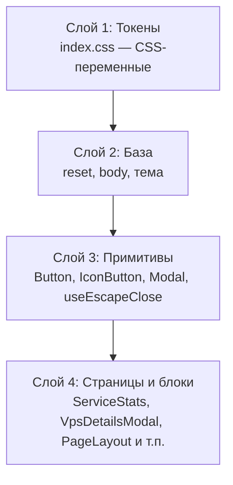

# Дизайн-система фронтенда

Справочник по дизайн-системе портала `family` (React 19 + TypeScript + Vite, `frontend/src/`).

Цель — единые токены и UI-примитивы вместо разрозненных классов в `index.css`: меньше дублей,
проще поддерживать темы (light/dark) и доступность. Система вводится постепенно, без изменения
API-контрактов и UI-поведения (Фазы 0–1 реализованы, следующие — в плане ниже).

## Слои

## Токены

Объявлены в `index.css` в блоках `:root` (светлая тема) и `[data-theme='dark']`.

### Семантические цвета статусов (одинаковы для обеих тем)

| Токен                                           | Значение               | Назначение                       |
| ----------------------------------------------- | ---------------------- | -------------------------------- |
| `--color-success`                               | `#22c55e`              | Индикатор «доступно» (точка)     |
| `--color-success-strong`                        | `#16a34a`              | Текст успеха на светлой подложке |
| `--color-success-bg`                            | `rgba(34,197,94,.1)`   | Подложка заметки/бейджа успеха   |
| `--color-success-halo`                          | `rgba(34,197,94,.15)`  | Кольцо точки/бейджа успеха       |
| `--color-success-border`                        | `rgba(34,197,94,.25)`  | Рамка заметки успеха             |
| `--color-warning`                               | `#f59e0b`              | Индикатор «проверка/неизвестно»  |
| `--color-warning-strong`                        | `#d97706`              | Текст предупреждения (янтарь)    |
| `--color-warning-bg` / `--color-warning-halo`   | `rgba(245,158,11,.15)` | Подложка/кольцо предупреждения   |
| `--color-critical`                              | `#f97316`              | Индикатор «частично недоступно»  |
| `--color-critical-strong`                       | `#ea580c`              | Текст частичной недоступности    |
| `--color-critical-bg` / `--color-critical-halo` | `rgba(249,115,22,.15)` | Подложка/кольцо критического     |
| `--color-danger`                                | `#ef4444`              | Индикатор «ошибка/недоступно»    |
| `--color-danger-strong`                         | `#dc2626`              | Текст ошибки                     |
| `--color-danger-bg`                             | `rgba(239,68,68,.1)`   | Подложка ошибки                  |
| `--color-danger-bg-strong`                      | `rgba(239,68,68,.12)`  | Подложка опасного hover          |
| `--color-danger-halo`                           | `rgba(239,68,68,.15)`  | Кольцо точки/бейджа ошибки       |
| `--color-danger-border`                         | `rgba(239,68,68,.25)`  | Рамка ошибки                     |

### Акценты разделов/страниц

| Токен                 | Значение  | Где используется                         |
| --------------------- | --------- | ---------------------------------------- |
| `--color-accent-teal` | `#14b8a6` | Иконка страницы «Новости», бейдж новости |
| `--color-accent-sky`  | `#0ea5e9` | Иконка страницы «Проекты»                |

> Акценты карточек разделов (`sections` в `HomePage.tsx`) и проектов приходят как inline `--accent`
> — остаются вне токенов (настраиваемые). Статусные цвета и акценты страниц — только через токены.

### Шкалы токенов (радиусы, отступы, типографика)

| Шкала        | Значения                                                                                          |
| ------------ | ------------------------------------------------------------------------------------------------- |
| `--radius-*` | `xs: 5px`, `sm: 6px`, `md: 8px`, `lg: 10px`, `xl: 14px`, `1xl: 16px`, `2xl: 20px`, `3xl: 24px`    |
| `--space-*`  | `1: 4px`, `2: 8px`, `3: 12px`, `4: 16px`, `5: 20px`, `6: 24px`, `8: 32px`, `10: 40px`, `12: 48px` |

Применены в примитивах (`btn`, `icon-btn`, `modal`) и основных оболочках (`.container`, `.card`,
`.modal__vps`, `.modal__service`, `.services-editor`).

Типографика — шкала `--font-size-2xs … 2xl` (`0.7 … 2.6rem`), применена в примитивах и заголовках
(`btn`, `.modal__head h3`, `.page__head h2`, `.brand h1`, `.hero h2`). Массовый перенос остальных
размеров страниц — отдельной задачей (требует визуальной ревизии).

### Текст и границы (консолидированные лестницы)

| Категория          | Канонические токены                                                         | Комментарий                                                                                                          |
| ------------------ | --------------------------------------------------------------------------- | -------------------------------------------------------------------------------------------------------------------- |
| Текст (3 уровня)   | `--text`, `--text-strong`; `--text-muted`; `--text-faint`; `--text-fainter` | Было 5 уровней (`muted/faint/fainter/dim/dim2`) — `dim`/`dim2` удалены; контраст `faint`/`fainter` поднят до WCAG AA |
| Границы (2 уровня) | `--border`, `--border-strong`                                               | Было 4 уровня (`border/strong/mid/soft`) — `mid`/`soft` удалены, значения объединены с `--border`                    |

## Примитивы

### `Button` (`components/Button.tsx`)

Кнопка действия/формы.

| Проп      | Тип                        | По умолчанию | Описание                             |
| --------- | -------------------------- | ------------ | ------------------------------------ |
| `variant` | `'secondary' \| 'primary'` | `secondary`  | Вторичная (по умолчанию) / акцентная |
| `icon`    | `ReactNode`                | —            | Иконка слева от текста (inline SVG)  |
| `type`    | `'button' \| 'submit'`     | `button`     | Тип кнопки (для форм — `submit`)     |

Остальные атрибуты `<button>` (onClick, disabled, className и т.п.) пробрасываются.

CSS: `.btn`, `.btn--primary`, `.btn__icon`.

### `IconButton` (`components/IconButton.tsx`)

Квадратная кнопка-иконка (выход, закрытие, обновление, «+», импорт, копирование, удаление).

| Проп       | Тип                    | По умолчанию | Описание                                           |
| ---------- | ---------------------- | ------------ | -------------------------------------------------- |
| `label`    | `string`               | —            | Доступное имя (`aria-label`)                       |
| `tooltip`  | `string`               | —            | Всплывающая подсказка (`data-tooltip`)             |
| `size`     | `'md' \| 'sm' \| 'xs'` | `md`         | 32 / 24 / 20 px                                    |
| `plain`    | `boolean`              | `false`      | Прозрачный фон (плотные списки)                    |
| `danger`   | `boolean`              | `false`      | Красный при наведении (удаление)                   |
| `active`   | `boolean`              | `false`      | Активное состояние (напр. «скопировано» — зелёный) |
| `spinning` | `boolean`              | `false`      | Вращение иконки (индикация обновления)             |
| `children` | `ReactNode`            | —            | Иконка (inline SVG) или текст (✕)                  |

CSS: `.icon-btn`, модификаторы `--sm/--xs/--plain/--danger/--active/--spinning`, подсказка `.icon-btn[data-tooltip]::after`.

### `Modal` (`components/Modal.tsx`)

Базовая модалка: подложка + карточка с заголовком и закрытием. Использует `useEscapeClose`.

| Проп              | Тип          | По умолчанию | Описание                               |
| ----------------- | ------------ | ------------ | -------------------------------------- |
| `title`           | `string`     | —            | Заголовок (`aria-labelledby`)          |
| `onClose`         | `() => void` | —            | Закрытие (крестик/подложка/Escape)     |
| `wide`            | `boolean`    | `false`      | Расширенная ширина (сетка детализации) |
| `actions`         | `ReactNode`  | —            | Кнопки-иконки справа от заголовка      |
| `closeOnEscape`   | `boolean`    | `true`       | Закрытие по Escape                     |
| `closeOnBackdrop` | `boolean`    | `true`       | Закрытие по клику на подложку          |

Доступность: диалог получает фокус при открытии, `aria-labelledby` на заголовок, фокус ловится
внутри (Tab/Shift+Tab) и возвращается элементу, открывшему модалку; прокрутка страницы блокируется
(`body { overflow: hidden }`).

CSS: `.modal-backdrop`, `.modal`, `.modal--wide`, `.modal__head`, `.modal__head-actions`.

### `useEscapeClose` (`hooks/useEscapeClose.ts`)

Хук закрытия по Escape. Обработчик всегда актуальный (через ref), слушатель переподписывается
только при смене `enabled`. Используется `Modal` (по умолчанию) и `VpsAddModal` (со своей логикой
«сначала закрыть редактор сервисов, затем форму» — у `Modal` тогда `closeOnEscape={false}`).

### `useApiData` (`hooks/useApiData.ts`)

Универсальный хук загрузки с одного API-эндпоинта: `{ data, error, loading, reload }`.
Защита от setState после размонтирования; `reload(next?)` позволяет подменить fetcher
(например `fetchVps(true)` для `?refresh=1`). На нём построены `useVps`/`useProjects`/`useHealth`.

## Правила использования

1. Новые кнопки — только через `Button`/`IconButton`, без ручных классов.
2. Новые модалки — только через `Modal` (+ `useEscapeClose` при особом поведении Escape).
3. Новые хуки данных — только через `useApiData`.
4. Статусные цвета, акценты страниц, радиусы и отступы — только через токены, без хардкода значений.
5. Иконки — inline SVG из `components/icons.tsx` (stroke, `currentColor`).

## Статус фаз

- ✅ **Фаза 1.** Токены статусных/акцентных цветов; примитивы `Button`/`IconButton`/`Modal`/`useEscapeClose`;
  дедупликация кнопок-иконок и модалок.
- ✅ **Фаза 2.** `useApiData<T>` — единый хук данных; `useVps`/`useProjects`/`useHealth` на нём.
- ✅ **Фаза 3.** Шкалы радиусов/отступов/типографики; консолидация «лестниц» текста (5→3 уровня) и границ
  (4→2 уровня) с подъёмом контраста; иконки темы (`SunIcon`/`MoonIcon`/`MonitorIcon`) — `currentColor`.
- ✅ **Фаза 4.** `Modal` — focus-trap, `aria-labelledby`, возврат фокуса; `SectionCard` без «мёртвых ссылок»;
  контраст мелких бейджей (через токены `--text-faint`/`--text-fainter`); стабильные uid-ключи в `ServicesEditor`.
